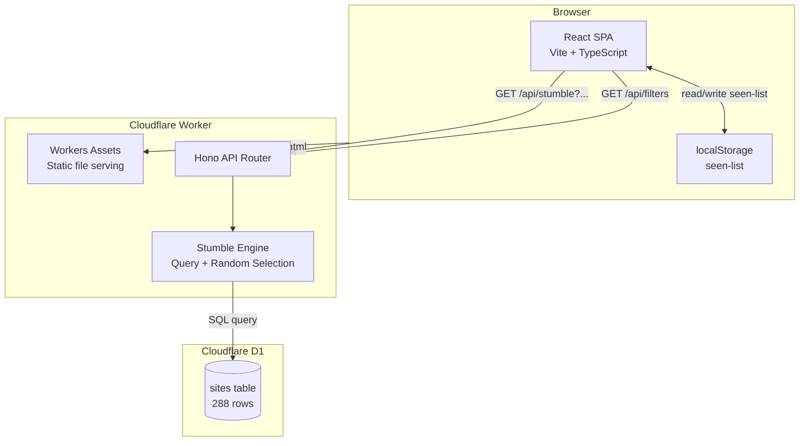

# Design Document: MVP Stumble

## Overview

The MVP Stumble feature delivers Surfdeck's core interaction: a user picks optional filters (mood, character, build) and presses "Stumble" to open one random independent website in a new tab. The system is a single Cloudflare Worker running a Hono API server that also serves the Vite-built React SPA as static assets. Cloudflare D1 (edge SQLite) stores the 288 hand-curated sites imported from CSV. Client state (seen-list, filter selections) lives in localStorage — no auth, no server-side user state.

The architecture prioritizes sub-2-second stumble responses, graceful degradation (blank provenance is fine, never an error), and a fluid UX where nothing blocks the next stumble.

## Architecture



### Request Flow

1. Browser loads SPA from Workers Assets (index.html + bundled JS/CSS).
2. SPA fetches available filter values from `GET /api/filters` on mount.
3. User optionally selects mood, character, and/or build filters.
4. User clicks Stumble → SPA synchronously opens a blank tab (`window.open('about:blank', '_blank')`) within the click gesture. If the tab is blocked, shows fallback message (rare with aggressive blockers).
5. SPA sends `GET /api/stumble` with filter params + seen-list.
6. Hono routes to the Stumble Engine, which builds a filtered D1 batch query (temp table for seen-list, filter conditions, `ORDER BY RANDOM() LIMIT 1`).
7. Worker responds with site data including precomputed provenance fields.
8. SPA navigates the pre-opened tab to the site URL (`tab.location.href = url`), renders the Provenance Card, and appends the site ID to the localStorage seen-list.
9. If the fetch fails or times out, SPA closes the blank tab (`tab.close()`) and shows the error/retry state.
10. If the pool is empty (zero-match or exhausted), SPA closes the blank tab and displays the appropriate message.

### Deployment Topology

A single `wrangler.jsonc` configures:
- `main`: points to the Hono worker entry (`src/worker/index.ts`)
- `assets.not_found_handling`: `"single-page-application"` for SPA client-side routing fallback
- D1 binding named `DB`

The Cloudflare Vite plugin handles local dev with D1 emulation.

## Components and Interfaces

### Worker Entry (`src/worker/index.ts`)

The Hono app with route definitions and D1 binding access.

```typescript
import { Hono } from "hono";
import { stumbleRoute } from "./routes/stumble";
import { filtersRoute } from "./routes/filters";

type Bindings = {
  DB: D1Database;
};

const app = new Hono<{ Bindings: Bindings }>();

// API routes
app.route("/api", stumbleRoute);
app.route("/api", filtersRoute);

// Explicit 404 for unknown /api/ routes
app.all("/api/*", (c) => c.json({ error: "Not found" }, 404));

export default app;
```

Workers Assets handles static file serving and SPA fallback automatically via `wrangler.jsonc` configuration — no manual static-file middleware needed.

### API Contracts

#### `GET /api/stumble`

Request query parameters:
| Param | Type | Required | Description |
|-------|------|----------|-------------|
| `mood` | string | no | One of: `useful`, `learn`, `waste_time`, `beautiful`, `think`. Omit or send `surprise` to skip mood filter. |
| `character` | string | no | One of: `modern_indie`, `old_web`, `retro_personal`, `minimal_static`. |
| `stack` | string | no | Comma-separated stack values (OR within dimension). |
| `host` | string | no | Comma-separated host values (OR within dimension). |
| `static_or_dynamic` | string | no | `static` or `dynamic`. |
| `seen` | string | no | Comma-separated site IDs (positive integers) already seen this session. IDs are validated server-side as positive integers before use. |

Response (200 — site found):
```json
{
  "status": "ok",
  "site": {
    "id": 42,
    "url": "https://example.com",
    "title": "Example Site",
    "why_note": "One line about why this site is here.",
    "mood_tags": ["learn", "beautiful"],
    "character": "modern_indie",
    "stack": "nextjs",
    "host": "vercel",
    "static_or_dynamic": "dynamic"
  }
}
```

Response (200 — zero match):
```json
{
  "status": "no_match"
}
```

Response (200 — exhausted pool):
```json
{
  "status": "exhausted"
}
```

Response (500 — server error):
```json
{
  "error": "Internal server error"
}
```

#### `GET /api/filters`

Returns available filter values derived from the corpus.

Response (200):
```json
{
  "stacks": ["nextjs", "hugo", "static_html"],
  "hosts": ["github_pages", "vercel", "neocities"],
  "static_or_dynamic": ["static", "dynamic"]
}
```

### React SPA Components

| Component | Responsibility |
|-----------|---------------|
| `App` | Top-level layout, state orchestration |
| `MoodSelector` | Six mood buttons, single-select with toggle-off |
| `CharacterFilter` | Four character options, single-select with toggle-off |
| `BuildFilter` | Three groups (stack, host, type) populated from `/api/filters`, multi-select within group |
| `StumbleButton` | Main CTA, disabled only during in-flight request. Manages the pre-opened tab reference (open-then-navigate pattern): opens blank tab synchronously on click, navigates on success, closes on failure. |
| `ProvenanceCard` | Displays stack/host/type for last stumbled site; blank-safe |
| `StatusMessage` | Renders zero-match, exhausted, or popup-blocked messages |

### Stumble Engine (Query Builder)

The core query logic lives in `src/worker/engine/stumble.ts`. It constructs a D1 batch that:

1. Always excludes NSFW (`WHERE nsfw = 0`)
2. Applies mood filter via `LIKE` against the semicolon-separated `mood_tags` column
3. Applies character filter via exact match on `character` column
4. Applies build filters (OR within each dimension, AND across dimensions)
5. Excludes seen IDs via a temp table + subquery (avoids D1's 100-param binding limit)
6. Orders by `RANDOM()` and limits to 1

```typescript
// Pseudocode for query construction + D1 batch execution
function buildStumbleBatch(params: StumbleParams): D1PreparedStatement[] {
  const batch: D1PreparedStatement[] = [];

  // --- Seen-list via temp table (avoids D1's 100-param binding limit) ---
  if (params.seen?.length) {
    // Validate: all seen IDs must be positive integers (server-assigned)
    const validIds = params.seen.filter((id) => Number.isInteger(id) && id > 0);
    batch.push(db.prepare("CREATE TEMP TABLE IF NOT EXISTS _seen (id INTEGER PRIMARY KEY)"));
    batch.push(db.prepare("DELETE FROM _seen"));
    // Inline validated integer IDs — safe because they are server-assigned, never user strings
    const values = validIds.map((id) => `(${id})`).join(",");
    batch.push(db.prepare(`INSERT OR IGNORE INTO _seen (id) VALUES ${values}`));
  }

  // --- Main query ---
  const conditions: string[] = ["nsfw = 0"];
  const bindings: unknown[] = [];

  // Mood filter (skip if absent or "surprise")
  if (params.mood && params.mood !== "surprise") {
    // mood_tags is semicolon-separated, use LIKE with delimiters
    conditions.push(
      "(mood_tags = ?1 OR mood_tags LIKE ?2 OR mood_tags LIKE ?3 OR mood_tags LIKE ?4)"
    );
    bindings.push(params.mood, `${params.mood};%`, `%;${params.mood}`, `%;${params.mood};%`);
  }

  // Character filter
  if (params.character) {
    conditions.push("character = ?");
    bindings.push(params.character);
  }

  // Build filters — OR within dimension
  if (params.stacks?.length) {
    conditions.push(`stack IN (${params.stacks.map(() => "?").join(",")})`);
    bindings.push(...params.stacks);
  }
  if (params.hosts?.length) {
    conditions.push(`host IN (${params.hosts.map(() => "?").join(",")})`);
    bindings.push(...params.hosts);
  }
  if (params.staticOrDynamic) {
    conditions.push("static_or_dynamic = ?");
    bindings.push(params.staticOrDynamic);
  }

  // Seen-list exclusion via temp table
  if (params.seen?.length) {
    conditions.push("sites.id NOT IN (SELECT id FROM _seen)");
  }

  const sql = `SELECT * FROM sites WHERE ${conditions.join(" AND ")} ORDER BY RANDOM() LIMIT 1`;
  batch.push(db.prepare(sql).bind(...bindings));

  return batch;
  // Execute with: const results = await env.DB.batch(batch);
  // The last result in the batch array contains the site row.
}
```

### Seed Import Script (`scripts/seed.ts`)

A Wrangler script (run via `npx wrangler d1 execute` or a custom `wrangler.toml` command) that:

1. Reads `data/featured-sites.csv` (UTF-8, header row)
2. Parses each row, skipping rows with empty `url`
3. Inserts into the `sites` table with `tier = 'featured'` and `added_at = ISO 8601 UTC now`
4. Preserves blank values as NULL for `stack`, `host`, `static_or_dynamic`
5. Uses `INSERT OR IGNORE` on `url` as deduplication key for idempotency
6. Uses D1 batch semantics (an array of prepared statements executed as an atomic unit) to insert all rows. The entire batch succeeds or fails together, providing atomicity without interactive transactions. D1 batch has a 1000-statement limit, so for 288 rows a single batch call suffices.

## Data Models

### D1 Schema (`schema.sql`)

```sql
CREATE TABLE IF NOT EXISTS sites (
  id INTEGER PRIMARY KEY AUTOINCREMENT,
  url TEXT NOT NULL UNIQUE,
  title TEXT NOT NULL,
  mood_tags TEXT NOT NULL,
  character TEXT NOT NULL,
  stack TEXT,
  host TEXT,
  static_or_dynamic TEXT,
  why_note TEXT NOT NULL,
  nsfw INTEGER NOT NULL DEFAULT 0,
  source TEXT NOT NULL,
  tier TEXT NOT NULL DEFAULT 'featured',
  added_at TEXT NOT NULL
);
```

### Column Mapping (CSV → D1)

| CSV Column | D1 Column | Type | Notes |
|------------|-----------|------|-------|
| `url` | `url` | TEXT NOT NULL UNIQUE | Deduplication key |
| `title` | `title` | TEXT NOT NULL | |
| `mood_tags` | `mood_tags` | TEXT NOT NULL | Stored as semicolon-separated string |
| `character` | `character` | TEXT NOT NULL | |
| `stack` | `stack` | TEXT (nullable) | Blank CSV → NULL |
| `host` | `host` | TEXT (nullable) | Blank CSV → NULL |
| `static_or_dynamic` | `static_or_dynamic` | TEXT (nullable) | Blank CSV → NULL |
| `why_note` | `why_note` | TEXT NOT NULL | |
| `nsfw` | `nsfw` | INTEGER NOT NULL | `false` → 0, `true` → 1 |
| `source` | `source` | TEXT NOT NULL | |
| *(added at ingest)* | `tier` | TEXT NOT NULL | Always `'featured'` |
| *(added at ingest)* | `added_at` | TEXT NOT NULL | ISO 8601 UTC timestamp |

### Client-Side State (localStorage)

| Key | Value | Purpose |
|-----|-------|---------|
| `surfdeck_seen` | JSON array of site IDs (`number[]`) | Exclusion set sent with each stumble request |

The seen-list is scoped to the browser session conceptually but persisted in localStorage so it survives tab refreshes within the same browsing session. A "reset" action clears this key.

### Mood Filter Query Strategy

The `mood_tags` column stores values like `learn;beautiful`. To filter for a single mood (e.g., `learn`), the query must handle four cases:
- Exact match: `mood_tags = 'learn'`
- Starts with: `mood_tags LIKE 'learn;%'`
- Ends with: `mood_tags LIKE '%;learn'`
- Contains: `mood_tags LIKE '%;learn;%'`

This avoids substring false positives (e.g., a hypothetical tag `relearn` matching `learn`).

## Correctness Properties

*A property is a characteristic or behavior that should hold true across all valid executions of a system — essentially, a formal statement about what the system should do. Properties serve as the bridge between human-readable specifications and machine-verifiable correctness guarantees.*

### Property 1: Stumble returns only filter-matching sites

*For any* combination of active filters (mood, character, stack, host, static_or_dynamic) and any corpus state, every site returned by the Stumble Engine SHALL satisfy all active filter constraints simultaneously — including character exact match and build filter OR-within-dimension, AND-across-dimensions.

**Validates: Requirements 1.1, 1.3, 2.2, 3.2, 4.2, 4.3, 6.1**

### Property 2: NSFW sites are never returned

*For any* stumble request regardless of filter combination or seen-list state, the Stumble Engine SHALL never return a site whose `nsfw` value is `true`.

**Validates: Requirements 12.1, 12.2**

### Property 3: Seen-list exclusion

*For any* stumble request containing a seen-list of site IDs, the Stumble Engine SHALL never return a site whose ID appears in the seen-list.

**Validates: Requirements 10.5**

### Property 4: Mood filter matches semicolon-separated tags

*For any* mood value from the set {`useful`, `learn`, `waste_time`, `beautiful`, `think`} and any site returned when that mood filter is active, the site's `mood_tags` field SHALL contain that mood value as one of its semicolon-separated entries — no substring false positives.

**Validates: Requirements 2.2**

### Property 5: Surprise and absent mood are equivalent

*For any* corpus state and set of non-mood filters, the candidate pool when `mood=surprise` SHALL be identical to the candidate pool when mood is omitted entirely.

**Validates: Requirements 2.3, 2.4**

### Property 6: Build filter OR-within-AND-across dimensions

*For any* stumble request with multiple build filter values selected within the same dimension (e.g., `stack=nextjs,hugo`), the returned site SHALL match at least one of the selected values in that dimension. When multiple dimensions have active selections, the site SHALL satisfy all active dimensions simultaneously.

**Validates: Requirements 4.2, 4.3**

### Property 7: Zero-match vs exhausted distinction

*For any* filter combination, if the corpus contains matching non-NSFW sites but all have been seen, the API SHALL return `exhausted` status. If the corpus contains no non-NSFW sites matching the filters (ignoring the seen-list), the API SHALL return `no_match` status. These two states are mutually exclusive.

**Validates: Requirements 1.4, 10.6, 11.1**

### Property 8: Seed import idempotency

*For any* CSV dataset, running the seed import process N times (N ≥ 1) SHALL produce the same row count and column values as running it exactly once — no duplicate rows are created.

**Validates: Requirements 8.4**

### Property 9: Provenance fields never contain "unknown"

*For any* site stored in D1 and returned by the Stumble Engine API, the `stack`, `host`, and `static_or_dynamic` fields SHALL either contain a value from the controlled vocabulary or be NULL/absent — never the literal string `"unknown"`.

**Validates: Requirements 5.3, 8.3**

### Property 10: Seed import preserves blanks as NULL

*For any* row in the source CSV where `stack`, `host`, or `static_or_dynamic` is blank (empty string), the corresponding D1 column SHALL be NULL after import — never a placeholder string.

**Validates: Requirements 8.3**

### Property 11: Filter endpoint returns exactly the distinct non-null values

*For any* corpus state, the `/api/filters` response SHALL contain exactly the distinct non-NULL values present in the `stack`, `host`, and `static_or_dynamic` columns — no blanks, no duplicates, no values absent from the data.

**Validates: Requirements 4.1, 4.5**

## Error Handling

| Scenario | API Behavior | SPA Behavior |
|----------|-------------|-------------|
| No matching sites for filters | Return `{ "status": "no_match" }` (200) | Display "Nothing in that corner right now." + sub-line |
| All matching sites already seen | Return `{ "status": "exhausted" }` (200) | Display "You've wandered the whole neighbourhood." + reset button |
| D1 query failure | Return `{ "error": "Internal server error" }` (500) | Keep Stumble button enabled, no blocking overlay |
| Network timeout (>5s client-side) | SPA aborts fetch via AbortController | Re-enable Stumble button, allow retry |
| Browser blocks popup | N/A (client-side detection) | Rare — only with aggressive blockers since `window.open` is called synchronously within the click gesture. Display popup-blocked message and provide the site URL as a clickable link in the current tab. |
| Unknown API route under `/api/` | Return `{ "error": "Not found" }` (404) | N/A |
| Invalid filter parameters | Ignore invalid values, treat as absent | N/A (SPA only sends valid values) |

### Design Decisions

1. **Zero-match vs exhausted as distinct API statuses** — The SPA needs to render different copy for each state. The API distinguishes them by running two queries: if the unfiltered-by-seen count is 0, it's `no_match`; if > 0 but filtered-by-seen count is 0, it's `exhausted`.

2. **Seen-list as IDs not URLs** — Integer IDs are cheaper to transmit and compare than full URLs. The SPA stores IDs after receiving them in the stumble response.

3. **200 status for no_match and exhausted** — These are expected application states, not errors. Using 200 with a status field keeps error handling simple (5xx = real errors, 200 = application results).

4. **AbortController with 5-second timeout** — The SPA sets a client-side timeout. If the Worker hasn't responded in 5 seconds, the fetch is aborted and the button re-enabled. This is simpler than server-side timeout coordination.

5. **`ORDER BY RANDOM() LIMIT 1`** — For 288 rows, a full-table random sort is negligible in cost. No need for more complex random-selection algorithms at this corpus size.

6. **Mood filter via LIKE patterns** — D1/SQLite doesn't have native array types. Using four LIKE patterns (exact, starts-with, ends-with, contains) on semicolon-separated values avoids substring false positives while keeping the query in a single statement.

7. **Workers Assets for static serving** — Cloudflare's Workers Assets feature handles static file serving with correct MIME types and SPA fallback natively, avoiding manual middleware or asset binding code.

8. **Temp-table for seen-list exclusion** — D1 has a limit of 100 bound parameters per query. The seen-list can grow to 288 (the whole corpus), which would exceed this limit with `NOT IN (?, ?, ...)`. Instead, the handler creates a connection-scoped temp table, inserts all seen IDs with inlined integer literals, and uses a subquery for exclusion. The IDs are server-assigned integers validated on receipt (must be positive integers), so inlining them is safe from SQL injection. This adds ~1-2ms overhead per request — negligible for a 288-row corpus. Alternative considered: sending the seen-list as a JSON body via POST and using `json_each()` — rejected because `json_each()` availability in D1 is not guaranteed and GET semantics are simpler for a read operation.

9. **Open-then-navigate for tab opening** — `window.open` called after an awaited `fetch()` is outside the browser's user-gesture window and gets blocked by Safari (and often Chrome). The fix: open a blank tab synchronously within the click handler (`window.open('about:blank', '_blank')`), then navigate it after the API response arrives (`tab.location.href = url`). On failure/timeout, close the blank tab. This makes popup blocking a rare edge case (only extremely aggressive blockers) rather than the default on Safari.

10. **No indexes at 288 rows** — The entire `sites` table fits in a single SQLite page (~4KB). Full table scans are faster than index lookups at this size because there is no I/O benefit — the query planner will ignore the indexes anyway. Indexes would only add write overhead during seed import. If the corpus grows to 10K+ rows, indexes should be reconsidered.

## Testing Strategy

### Property-Based Testing (PBT)

The Stumble Engine's query-building and filtering logic is well-suited to PBT: it's pure-functional (input params → SQL result set constraints), the input space is combinatorial (6 moods × 4 characters × N stacks × N hosts × 2 types × variable seen-lists), and universal properties should hold across all valid inputs.

**Library:** [fast-check](https://github.com/dubzzz/fast-check) (TypeScript PBT library)

**Configuration:**
- Minimum 100 iterations per property test
- Each test tagged with: `Feature: mvp-stumble, Property {N}: {title}`

**Properties to implement as PBT:**
- Property 1: Filter-matching (generate random filter combos and corpora, verify all results match all active constraints)
- Property 2: NSFW exclusion (generate corpora with NSFW sites, verify none returned regardless of filters)
- Property 3: Seen-list exclusion (generate random seen-lists, verify returned site never in list)
- Property 4: Mood filter semicolon parsing (generate mood values, verify LIKE pattern matches correctly without substring false positives)
- Property 5: Surprise equivalence (verify mood=surprise produces same pool as mood=absent)
- Property 6: Build filter OR/AND (generate multi-value selections, verify OR-within AND-across)
- Property 7: Zero-match vs exhausted (generate filter+seen combos, verify correct status)
- Property 8: Seed idempotency (run import N times, verify same result)
- Property 9: No "unknown" strings (verify provenance fields are NULL or valid vocabulary)
- Property 10: Blanks preserved as NULL (generate CSV with blanks, verify D1 has NULL)
- Property 11: Filter endpoint accuracy (generate corpora, verify /api/filters returns exact distinct non-null values)

### Unit Tests (Example-Based)

- Property 5: "Surprise" mood equivalence (specific examples showing surprise = no filter)
- Mood LIKE pattern edge cases (tags that are substrings of each other)
- API route 404 for unknown `/api/` paths
- Provenance Card rendering: all blank → "Hand-made on the open web."
- Provenance Card rendering: partial fields → only non-blank shown
- SPA popup-blocked detection
- SPA state transitions (idle → loading → result/error)
- Filter UI: single-select behavior for mood and character
- Filter UI: multi-select behavior for build filters
- Seen-list localStorage persistence and reset

### Integration Tests

- Full stumble request/response cycle against local D1 (via `wrangler dev` or Miniflare)
- Seed import: verify row counts, NULL handling, idempotency against local D1
- Workers Assets: verify correct MIME types for JS/CSS/HTML
- SPA fallback: non-API, non-asset paths return index.html with 200

### Test Runner

Vitest (ships with the Cloudflare Vite plugin template and supports `cloudflare:test` module for D1 bindings in tests).
