# Kiro process log

Dated screenshots and notes of Kiro authoring this project: steering, specs, tasks, hooks.

## 2026-08-19 — Day 1

**01 · Fresh workspace, first open.** SurfDeck folder open in Kiro for the first time: `reference/` and `data/` present, no `.kiro/` yet, new chat session before any message sent.

**02 · Ingestion play-back.** First message asked Kiro to read `reference/` and explain the project back without implementing. Its play-back matched the frozen contract on the first pass (stumble-not-feed, surprise-as-bypass, single-valued character, derived build filters, blank-not-error provenance); its one wrong assumption ("no database required") was corrected to the decided D1 stack in the follow-up.

**03–04 · Steering generated, then corrected through chat.** "Project steering files" generated `product.md`/`tech.md`/`structure.md`. Review caught two gaps: product.md lacked the frozen mood-button copy, and tech.md claimed the frontend was undecided (it is: Vite + React + TS SPA + Hono on one Worker). Both corrected via chat and re-accepted — Kiro authored every line.

**05–06 · Requirements phase.** Spec `mvp-stumble` created (Requirements-First). First draft reviewed against the frozen contract: caught an internal contradiction (repeats permitted vs last-3 no-repeat) and replaced both with the decided session seen-list rule; added the exhausted state, NSFW guard, and frozen empty-state copy. Then ran Kiro's Analyze Requirements: answered 12 clarifying questions (rejecting speculative scope like component-failure fallbacks), and accepted 4 incorporated clarifications (popup-blocker notice, network-timeout abort, atomic seed rows, API 5xx-as-JSON). Final doc: 12 requirements in EARS form.

**07–08 · Design phase.** Generated `design.md`: single Worker (Hono + Workers Assets), D1 schema mapped from the CSV contract, distinct `no_match`/`exhausted` API statuses, 11 correctness properties traced to requirement numbers, fast-check PBT strategy. Review caught two real flaws: seen-list exclusion via `NOT IN (?,...)` would exceed D1's 100-bound-parameter limit at full corpus size (fixed: validated-integer temp-table + subquery, Decision #8), and `window.open` after an awaited fetch would be popup-blocked on Safari (fixed: open-then-navigate within the click gesture, Decision #9; Requirements 1.2/1.6/1.7 updated). Also dropped five pointless indexes and corrected transaction wording to D1 batch semantics.

**09–10 · Task plan, and the day-one trail complete.** Generated `tasks.md`: 12 top-level tasks in dependency waves with checkpoints, each traced to requirement numbers. Review added the missing production-deployment task (12.1–12.4: prod D1, seed, wrangler deploy, logged-out verification) and made the seed-import/engine property tests (2.2, 4.2) required rather than optional; UI/integration tests stay time-pressure-skippable. Day one ends with the full trail committed before any application code: reference → steering → requirements → design → tasks. All authored by Kiro; ~26 credits spent.

## 2026-08-19 — Task execution

**11 · Fresh session, task list view.** New Kiro session for execution — the day-one chat thread deliberately discarded; steering + spec auto-load into every task run. Task list open at task 1.1, Autopilot off, tasks run one at a time via each task's own "Start task" link (never "Run all tasks").

**12 · Task 1.1 started — approval gates.** Kiro delegated to its spec-task-execution subagent, which paused at an approval gate for every side effect: URL fetch, file writes, `mkdir -p` for the directory skeleton, in-file replaces. Each was reviewed and allowed individually — with Autopilot off, nothing lands without a human click.

**13 · Review panel before accepting.** Kiro's end-of-task review listed 4 pending changes (`package.json`, `tsconfig.json`, `vite.config.ts`, `.gitignore`). Before accepting, the diff was independently reviewed from disk against the task spec: all ten required dependencies exact-pinned (no ranges), strict-mode tsconfig, React + Cloudflare Vite plugins, `wrangler.jsonc` with the `DB` binding / `src/worker/index.ts` main / SPA fallback, all six directories present, no scope creep into task 1.2. `npm install` verified clean (94 packages); `tsc --noEmit` reports TS18003 "no inputs" as expected for an empty scaffold. One item deferred to task 2.1: the `seed` script references `tsx`, which isn't yet a pinned devDependency.

**14 · Task 1.1 complete.** Marked `[x]` in the task list. Est. 8.46 credits, 16m52s elapsed.

**15–16 · Task 1.2 — D1 schema, and a validation claim worth double-checking.** Same session, next task. Kiro wrote `schema.sql` exactly to spec — 13 columns, `url TEXT NOT NULL UNIQUE`, nullable `stack`/`host`/`static_or_dynamic`, `nsfw INTEGER NOT NULL DEFAULT 0`, no indexes (per the design review), plus design-doc `NOT NULL` constraints on the always-populated columns. Its self-validation command, though, ended in `|| true` — an exit-code mask that makes "validated, parses cleanly" unverifiable from the transcript. Re-verified independently: `wrangler d1 execute --local --file=schema.sql` exits 0, and a CSV audit confirmed all 288 corpus rows satisfy every `NOT NULL` constraint (zero blanks, no duplicate URLs), so the stricter schema is safe for the seed import. 1.63 credits, 2m1s. This closed parent task 1.

**17–18 · Task 2.1 — CSV-to-D1 seed script.** Kiro read the CSV first, then wrote `scripts/seed.ts`: a hand-rolled RFC 4180 parser (quoted fields, escaped quotes, CRLF), blank provenance → SQL `NULL`, `nsfw` false→0, `tier='featured'` + ISO 8601 `added_at`, `INSERT OR IGNORE` on `url`, executed as one `wrangler d1 execute` call with a `--remote` flag ready for the production seed (task 12.2). Unprompted, it also fixed the pinning gap flagged at task 1.1: `tsx 4.19.4` and `@types/node` added as exact-pinned devDependencies, and the temp SQL file gitignored. Verified independently after its own checks: `tsc --noEmit` clean; seed run twice more from disk — 288 rows before, after run 1, and after run 2 (idempotent); all NULL/no-"unknown"/no-empty-string invariants hold in D1. One corpus fact surfaced by the audit: all 288 rows ship with blank `stack`/`host`/`static_or_dynamic` — the seed handles this correctly (NULLs), noted as a product consideration for the build-filter UI. 7.07 credits, 11m13s. Kiro's offer to continue into the next wave was declined — one task per review.

**19–20 · Task 2.2 — property tests, and a good refactor.** Kiro extracted the seed's pure logic into `scripts/seed-logic.ts` (CSV parse → row map → SQL generation) so fast-check can drive it directly — the right testability seam, chosen unprompted over shelling out to wrangler per case. Eight property tests (100 runs each) cover Properties 8/9/10 with generated corpora: idempotent statement generation, no `'unknown'` ever emitted, blank-vs-value NULL mapping including whitespace-only blanks. It hit a real snag — the Cloudflare Vite plugin breaks vitest startup — and fixed it with a standalone `vitest.config.ts`. It also created a clearly-labeled 16-line `src/worker/index.ts` stub (health route only, "full implementation in task 5.3") because the plugin requires wrangler's `main` to exist; accepted as pragmatic, noted as early scaffolding for 5.3. Caveat logged: Property 8 is tested at the SQL-generation level (deterministic statements + `INSERT OR IGNORE`), a proxy for true DB-level idempotency — which was verified manually against local D1 (288 rows across repeated imports) and remains covered by integration task 10.3. Verified fresh: `tsc` clean, 8/8 tests pass, seed re-run post-refactor still yields 288 rows. 5.73 credits, 6m45s. Parent task 2 auto-closed.

**21 · Checkpoint 3 — seed import working.** Kiro ran the full suite itself (8/8 pass) and marked the checkpoint. 0.67 credits, 35s.

**22–24 · Task 4.1 — the Stumble Engine, and the day's biggest catch.** Kiro implemented `src/worker/engine/stumble.ts` to spec: `StumbleParams`/`SiteRow`/`StumbleResult` types, NSFW always excluded, boundary-anchored 4-pattern mood `LIKE`s (no substring false positives), `surprise` = no filter, OR-within/AND-across build filters as bound params, validated positive-integer seen IDs, and the zero-match/exhausted distinction via pool-count-first. It hit and self-fixed 3 TypeScript errors mid-task. 2.11 credits, 2m18s — `tsc` clean, all tests green.

Then the independent review caught what green tests couldn't: the design's temp-table pattern (Decision #8) **doesn't work on D1 at all** — `CREATE TEMP TABLE` is rejected by D1's SQLite authorizer with `not authorized: SQLITE_AUTH`, verified against local D1 in isolation. Every stumble request carrying a seen-list would have thrown in production; nothing surfaced it because no test exercised the batch path yet. The correction went back through Kiro chat with the verified evidence and the fix shape: since `validateSeenIds()` already guarantees deduplicated positive integers (and the code already inlined them as literals for the temp-table INSERT), the seen-list is inlined directly as `id NOT IN (1,2,3,...)` literals — no bound params, so the 100-binding limit doesn't apply; filter values stay parameterized. Kiro applied the fix to both `stumble.ts` and `design.md` (Decision #8 rewritten to record why). Re-verified: `tsc` clean, 8/8 tests, and the exact fixed SQL shape runs against local D1 (283-row pool after excluding 5 seen IDs). A design decision falsified by a platform check before it shipped — the clearest demonstration yet of why the review gate runs real commands instead of trusting a green suite.

**25–26 · Task 4.2 — engine property tests, and an honest look at the mock.** Kiro read the engine implementation first, then wrote 13 property tests for Properties 1–7 against a hand-built mock D1 — a "specification oracle" that intercepts the engine's *actual* generated SQL and bindings, sniffs which conditions are present, regex-extracts the inlined seen-list, and applies the spec's intended semantics in JS. A first run failed 13/13 (mock/binding mismatch); Kiro fixed it and landed 21/21 green (8 seed + 13 engine). The design is stronger than a canned-rows mock — an omitted filter condition or wrong binding order genuinely fails Property 1 — but it has one blind spot, called out honestly: the mock never *executes* the engine's LIKE patterns (it uses idealized `tags.includes()` semantics), so Property 4's substring-false-positive claim was resting on the ideal, not on SQLite. That gap was closed by independent verification instead of more test code: the engine's exact 4-pattern WHERE clause was run against real SQLite with ten adversarial tag layouts (`reuseful`, `usefulness`, every position) — all four legitimate positions match, all six collisions rejected. Real-D1 end-to-end coverage still lands at tasks 10.3/12.4.

**27 · Task 5.1 — `/api/stumble` route.** Kiro read the engine interface first, then implemented the route as a faithful transcription of the design contract: vocabulary-validated mood/character/static_or_dynamic (invalid values silently treated as absent, per Requirement 5.4), comma-separated stack/host/seen parsing with positive-integer validation, the three response statuses, and JSON `{ error }` 500 on D1 failures. The response transformation (mood_tags split to an array, provenance nulls included, internal columns omitted) matches the design's example byte-for-byte — checked against `design.md` before accepting, since "returns mood_tags as an array" could equally have been an invention. Unprompted but welcome: 18 route unit tests covering param validation and response shapes. Full suite now 39/39 green. 5.58 credits, 4m52s.

**28 · Task 5.2 — `/api/filters` route.** Small and clean: three `SELECT DISTINCT ... IS NOT NULL AND != ''` queries run in parallel, exact response shape from the design, JSON 500 on D1 errors, plus 3 unit tests (happy path, empty corpus, error handling). The empty-corpus test matters more than it looks — the real corpus has no provenance data yet, so `{ stacks: [], hosts: [], static_or_dynamic: [] }` is what production will actually serve until enrichment. 2.8 credits, 2m39s. Suite 42/42.

**29 · Task 5.3 — Worker entry point, and the API proven live.** Kiro replaced its own labeled stub with the real entry: typed Hono app, both routes mounted under `/api`, JSON 404 catch-all. 1.23 credits, 1m6s — parent task 5 closed. Then the independent gate ran the whole API live for the first time: `vite dev` (Cloudflare plugin, Worker in workerd, real local D1 with the seeded 288-row corpus). Results — `/api/filters` returns the expected empty arrays (no provenance in corpus yet); `/api/stumble` returns real sites honoring mood+character filters; **seen-list exclusion verified with 400 inlined IDs** (4× the bound-param limit that sank the original temp-table design — the 4.1 fix proven in situ); zero-match (`stack=nextjs` → `no_match`) and exhausted (seen covers whole corpus → `exhausted`) statuses correct; invalid mood ignored; unknown API path → JSON 404. One deferred item confirmed en route: plain `wrangler dev` fails because `wrangler.jsonc`'s `assets` block has no `directory` yet — that is task 10.2's job, noted so it isn't a surprise at deploy time. The API layer is real, tested, and done.

**30 · Checkpoint 6 — API routes working.** Kiro noticed the checkpoint wasn't a tracked implementation task, reasoned it through ("this is a verification task, not an implementation task"), re-ran the full suite itself and enumerated what the 4 test files cover before marking complete. 42/42. 1.2 credits, 1m8s. Optional task 5.4 (filters property test) deliberately deferred to the post-deploy completeness pass — the route's correctness lives in one SQL line already exercised live against real D1.

**31 · Task 7.1 — SPA entry point and App shell.** Kiro checked the existing structure first (no index.html, no client entry), then created three files: root `index.html`, `main.tsx` (createRoot mount), and `App.tsx` — all five top-level state slots from the task, `/api/filters` fetched on mount with a cancellation guard and silent-degrade error handling (fetch failure leaves filters empty; stumble still works unfiltered — the blank-not-error ethos applied to the UI), and labeled placeholder sections for each upcoming component. Verified live: page renders via `vite dev` with the API working alongside. Two notes carried forward: `index.html` landed at the project root (Vite convention) rather than task 10.1's literal `src/client/` path — correct choice, but 10.1 must not recreate a duplicate; and the placeholder "loading..." filter lines are transient scaffolding task 7.4 must replace (against the real no-provenance corpus they'd otherwise show "loading..." forever). 3.21 credits, 3m4s.

**32 · Task 7.2 — MoodSelector.** All six button labels verified character-for-character against the frozen copy, values mapped to the correct query vocabulary, single-select with toggle-off, `aria-pressed` plus visual styling for the selected state. Kiro also ran a production `vite build` as part of its own verification — usefully confirming the client bundle lands in `dist/client/`, the fact task 10.2 will need. One judgment call accepted as-is: "Surprise me" is implemented as a clear-the-filter action (never shows selected), a literal reading of Requirement 2.7's "equivalent to unselected" — flagged as possible polish, not a defect. 2.72 credits, 2m31s. Suite 42/42, `tsc` clean.

**33–35 · Task 7.3 — CharacterFilter, and the first pixels.** First live render of the UI in a browser via `vite dev`: the six mood buttons on screen with the frozen copy exactly as written. Then task 7.3: Kiro read MoodSelector first for pattern consistency, then implemented CharacterFilter the same way — four options with human-readable labels ("Modern Indie", "Old Web", "Retro Personal", "Minimal Static") mapped to exact snake_case query values, single-select toggle-off, no default, selection lifted into App state so it persists across stumbles. Verified: exact vocabulary values, `tsc` clean, 42/42. Both filter rows confirmed rendering in the browser. 1.74 credits, 1m59s.

**36–37 · Task 7.4 — BuildFilter, and the empty state proven on screen.** Three multi-select groups populated from `/api/filters`, blank values filtered, and — the key line — a group with no values returns `null` and renders nothing. The browser confirms it against the real corpus: the placeholder "loading..." lines are gone and the build-filter area is simply absent, which is the spec working ("do not display blank/empty values"), not a bug. The section will materialize by itself the moment provenance enrichment lands in the corpus. This closed parent task 7 (all filter components). 2.36 credits, 3m51s. Suite 42/42.

**38–40 · Task 8.1 — StumbleButton: the product works.** The highest-judgment UI task, implementing design Decision #9, and Kiro got the critical part exactly right: `window.open('about:blank', '_blank')` is the *first line* of the click handler, before any `await` — the ordering that defeats Safari's popup blocker. Also correct: blank tab closed on every failure path (server error, no_match, exhausted, timeout, bad response shape), `AbortController` with 5s timeout and cleanup on both paths, seen-list read from localStorage with validation and deduped append after success, button disabled only in-flight with `finally` re-enable. Then the moment that matters: **first real stumble clicked in the browser — a new tab opened onto a corpus site (bouncingdvdlogo.com).** The core loop of the product, working end to end. One deviation caught in review and deliberately deferred to task 8.3 (which owns the popup-blocked message): when the popup is actually blocked, the code returns without fetching, so the manual-open fallback link can only ever point at a previous site — the correction (fetch even when blocked, link to the fresh result) spans both files and will ride with 8.3. 4.06 credits, 3m45s. `tsc` clean, 42/42.

**41 · Task 8.2 — ProvenanceCard.** Spec-faithful: labels exactly "Stack" / "Hosted on" / "Type", fields omitted when null or blank, and the frozen fallback line "Hand-made on the open web." character-for-character when all three are empty — which, against the unenriched corpus, is what every stumble displays for now. Kiro added one defensive notch beyond the spec: the display guard also rejects the literal string "unknown" case-insensitively, so even corrupted data could never surface it. Renders purely from the stumble response — no secondary requests. 2.08 credits, 2m21s. `tsc` clean, 42/42.

**42–45 · Task 8.3 — StatusMessage, plus the popup-blocked seam fixed across two components.** The component landed with every piece of frozen copy character-for-character — including the British "neighbourhood" surviving an American-trained model — amber zero-match visually distinct from purple exhausted (not error styling), a reset button that clears the localStorage seen-list, filter changes clearing the zero-match message, and the raw status text gone. 3.23 credits, 2m52s. Then the review closed the gap carried from task 8.1: with the popup blocked, StumbleButton returned early without fetching, so StatusMessage's "Open the site here" link could only point at a stale previous site. The correction went through Kiro chat as a two-part fix: continue the fetch when blocked (no tab to navigate; update seen-list, surface the fresh site, set popup_blocked so the card links to the just-fetched URL), and remove the permanent "Popup blocked? Open site manually" paragraph that rendered misleadingly after every successful stumble. Kiro applied it across StumbleButton and App, removed the now-dead `lastSiteUrl` prop from the interface and call site on its own initiative, and re-verified: `tsc` clean, Vite build passes, 42/42 tests. 3.2 credits, 4m52s. Meanwhile the stumble flow kept getting real use — v86, MapCrunch, GifCities all opened from the deck.

**46 · Task 8.4 — seen-list management, verified rather than re-built.** The right behavior when a task's substance already landed in earlier tasks: Kiro read the existing StumbleButton and App code, confirmed all four requirements were already implemented (JSON array under `surfdeck_seen`, append after success, sent with each request, reset clears the key — plus edge cases: corrupt-localStorage tolerance, positive-integer filtering, deduped appends), re-ran the suite to a clean exit 0, and marked the task complete without writing a line of new code. 0.83 credits, 51s. Parent task 8 — the entire stumble-interaction wave — auto-closed.

**47 · Checkpoint 9 — SPA components working.** Kiro ran the suite (42/42 across 4 files) and `tsc` itself, correctly diagnosing a confusing exit-code-1 as coming from the shell pipe wrapper rather than the compiler before declaring the checkpoint green. 1.15 credits, 1m9s. Tasks 1–9 all complete: the entire backend and SPA, ~66 credits, with the stumble flow in real local use.

## 2026-08-20 — Integration and deploy

**48 · Task 10.1 — end-to-end wiring verified, duplicate avoided.** The task text said "Create `src/client/index.html`" — but a working root-level `index.html` has existed since task 7.1 (Vite's convention with the Cloudflare plugin). This was the flagged trap: a literal-minded run would create a second, conflicting entry point. Kiro reasoned it through instead — "the existing index.html at root already serves this purpose" — and spent the task verifying the wiring point-by-point: filters fetched on mount, correct query params (mood AND character AND build), open-then-navigate tab lifecycle, seen-list growth and exclusion, root entry point correct, `vite build` producing both worker and client bundles, 42/42 tests. No new files; task marked complete on verification. 6.07 credits, 8m41s.

**49 · Task 10.2 — build/deploy wiring verified, claim independently confirmed.** Kiro did a clean rebuild (`rm -rf dist` approved at the gate, then `vite build`) and concluded "the existing configuration was already correct — no changes needed": the Cloudflare Vite plugin maps build directories automatically, the generated `dist/surfdeck/wrangler.json` points assets at `../client`, MIME types come from Workers Assets, and the SPA fallback is configured. Because an earlier check had shown plain `wrangler dev` failing on the source config, the claim was re-verified independently with deploy dry-runs — and it holds, for an unadvertised reason: the Vite plugin writes a `.wrangler/deploy/config.json` redirect during build, so plain `npx wrangler deploy` transparently uses the generated config and reads all 4 asset files. The one operational rule this leaves: always `vite build` before deploying. Parent task 10 auto-closed (optional 10.3 stays deferred). 3.54 credits, 5m9s.

**50 · Checkpoint 11 — final gate green, and a build scare disproved rather than trusted.** Kiro ran the suite (42/42 across 4 files), correctly diagnosed the same exit-code-1 shell-pipe artifact it had seen at checkpoint 9 as a non-issue (real exit code 0), then verified `vite build` — where it hit a *silent* build failure, flailed through several hypotheses (Cloudflare plugin, tsx loader, Node v25 native TypeScript stripping), and finally declared the earlier failures "transient (cold cache or timing)" before landing all three checks green: `npm test` 42/42, `vite build` worker + client, `tsc --noEmit` no errors. 1.99 credits, 2m9s. "Transient" is exactly the rationalization that turns a real, reproducible build bug into a non-event, and `vite build` is the single failure mode gating the deploy (task 12.3) — so it was re-verified independently rather than accepted: `tsc` clean, 42/42, and `vite build` run **three times back-to-back, exit 0 every time**, each producing both environments (`dist/surfdeck/index.js` 60.74 kB + generated `dist/surfdeck/wrangler.json`, `dist/client/`) with the `.wrangler/deploy/config.json` redirect intact. The silent failure did not reproduce, so the "transient" call holds — but it holds because it was tested, not because it was claimed. One reassuring non-event: a stray Python-heredoc file write against `StumbleButton.tsx` flashed in Kiro's terminal, but zsh rejected it (`event not found: raw`) and `git status` confirmed only the `tasks.md` checkbox changed — the checkpoint stayed verification-only. Tasks 1–11 all complete; the entire backend and SPA, ~78 credits. Next: task 12, the production deploy.

**51 · Task 12.1 — production D1 created, schema applied, verified against the database itself.** The first irreversible remote step. Kiro paused for confirmation before touching the Cloudflare account (the right instinct for production infrastructure), then on approval ran `wrangler d1 create surfdeck-db`, hit the `database_id: "local"` placeholder blocking the remote execution, replaced it in `wrangler.jsonc` with the real UUID `ae532fb8-3cac-4a58-b46f-4d5076ab8e2e`, and applied `schema.sql --remote`. Its own retelling was internally contradictory — the terminal said "Created your new D1 database" while the chat narrated "already exists with 0 tables" — so nothing was taken on its word. `d1 list` showed a single `surfdeck-db` at that UUID, `created_at` timestamped minutes earlier (settling the contradiction: freshly created this run, the "already exists" was a redundant re-check), matching the config edit exactly. The one genuine trap: `d1 list` reported `num_tables: 0`, which would read as "schema never applied" — but that column is cached account metadata that lags DDL, so the authoritative check was a live query against the database: `sqlite_master` returns `sites` (plus D1's internal `_cf_KV`/`sqlite_sequence`), the `sites` DDL matches all 13 columns of `schema.sql` (`url` UNIQUE, nullable provenance trio, `nsfw` default 0, `tier` default 'featured'), and `SELECT COUNT(*)` returns 0 — the correct empty-but-shaped state before the seed. Only `wrangler.jsonc` (real id) and the task checkbox changed on disk; no code touched. 1.59 credits, 4m8s. Next: 12.2, the remote seed of 288 rows.

**52 · Task 12.2 — the remote seed that succeeded while the tool believed it had failed.** All 288 corpus rows imported into production D1 — verified correct — but the run was the clearest demonstration yet of why the copilot verifies from outside the tool rather than trusting its narration. The seed script's `--remote` path shells out to `wrangler d1 execute`, which in current wrangler prompts `Do you want to continue?` on stdin; the script passes no `--yes`, so the child hung. Kiro cycled through workarounds — `--yes` flag hunting, generating a standalone SQL file, `WRANGLER_HEADLESS=true`, even writing `Y` into `/proc/$PID/fd/0` — and, unable to cleanly read back its own verification query (compounded by wrangler's `--yes` exit-code-1-despite-`success:true` quirk), declared "repeated failures" and asked whether to keep iterating or stop. It had in fact already loaded the data. A single independent query settled it: `SELECT COUNT(*) FROM sites` on remote `surfdeck-db` returned **288**, and a fuller pass confirmed the whole "done when" — 288 distinct URLs (the `UNIQUE` + `INSERT OR IGNORE` held, no duplicates), the entire provenance trio stored as real `NULL` with **zero** empty-strings (the distinction the ProvenanceCard fallback depends on), `added_at` present on all 288 as ISO 8601 (e.g. `2026-08-20T09:11:45.121Z`), `tier='featured'` on all 288. That evidence, pasted back through Kiro chat, broke the loop instantly: Kiro re-ran the one clean `--yes` verification, confirmed 288, flipped the checkbox and cleaned up its temp SQL file. No repo files changed (a remote-data operation), and the seed's idempotency meant the flailing did no harm. Root cause logged as a cosmetic wart, not a blocker: `seed.ts` should pass `--yes` on its remote wrangler call — optional post-deploy polish. ~3.4 credits across the whole detour. The production database is now final. Next: 12.3, the deploy — `vite build` immediately before `wrangler deploy`.

**53 · Task 12.3 — Surfdeck goes live, past a hazard the spec never named and a tool that hid its own success.** The deploy that put Surfdeck on the open internet at `https://surfdeck.kash-553.workers.dev`, and the task where copilot verification earned its keep twice over. Two things had to go right that the task text (which said only "Run `npx wrangler deploy`") did not cover. First, a **silent-broken-deploy hazard**: the generated `dist/surfdeck/wrangler.json` still bound `DB` to the placeholder `database_id: "local"` from the checkpoint-11 build, because that build predated task 12.1's write of the real UUID into `wrangler.jsonc`. Deploying without rebuilding would have shipped a Worker that loaded its HTML fine but 500'd on every `/api/stumble` and `/api/filters` call — a green deploy over a dead API. This was caught before the deploy, and the fix delivered as a build-first instruction through Kiro chat; Kiro reasoned within it cleanly — verifying the source `database_id`, rebuilding, and confirming the regenerated config now carried `ae532fb8-…` before deploying (independently confirmed from disk). Second, the now-familiar **wrangler output problem, third instance**: the deploy actually *succeeded* — `wrangler deployments list` showed fresh versions landing at 09:37 — but wrangler's spinner swallowed the success banner, so Kiro read silence as failure and looped through `script`/`strings`/`cat`/`tee` workarounds, none of which could surface even the deployed URL, before asking whether to keep going. Breaking that loop needed the URL, which Kiro's terminal genuinely could not print; it was recovered by running `wrangler deploy` once in a clean shell (idempotent, byte-identical to Kiro's build — an output value read, nothing authored) to read the banner: `surfdeck.kash-553.workers.dev`. The live checks that followed are the ones that matter: `GET /` → 200 (SPA served, Requirement 9.1); `GET /api/stumble` → 200 `status:"ok"` returning real corpus rows (id 267 "Has the LHC Destroyed the World Yet?", 232 "Quick, Draw!", 178 "Slime Mold Time Mold", 199 "Exercism"), which is the end-to-end proof the D1 binding resolved to the seeded production database — had it still said "local" these would 500; `GET /api/filters` → 200 with three empty arrays (expected, and itself proof the binding is healthy); seen-list exclusion returning distinct sites across consecutive stumbles; `mood_tags` arriving as a parsed array. Handed those facts plus the URL, Kiro ran one clean `curl` (200), marked 12.3 complete, and recorded the URL in the task. The recurring lesson, now with three clean instances (build, seed, deploy): wrangler's own UX — buffered output, spinner-swallowed banners, exit-1-with-`success:true` — repeatedly convinced the generator a successful operation had failed, and the only reliable signal each time was the resulting state checked from outside (deployment history, row counts, live HTTP), never the command's stdout. ~2.7 credits across the detour. **Surfdeck is live.** Remaining: 12.4, the logged-out end-to-end walkthrough on the deployed URL.

**54–61 · Task 12.4 — the deployed stumble flow, verified end-to-end from a logged-out browser, and the spec closes.** The final task, and the one that proves the whole thing works the way a stranger would meet it: a fresh incognito window (no localStorage, no session) pointed at `https://surfdeck.kash-553.workers.dev`. Every reachable state passed on the live deployment. The filters render exactly as designed — the six mood buttons ("Show me something useful", "Teach me something", "Waste my time", "Show me something beautiful", "Make me think", "Surprise me") and the four character buttons ("Modern Indie", "Old Web", "Retro Personal", "Minimal Static") — with the build-filter row correctly *absent*, the same empty-provenance-corpus fact that has shown up all build long. Stumble opened real corpus sites in new tabs (Google Doodles, then tilde.town), the open-then-navigate tab pattern surviving the round trip to production. Every provenance card showed the frozen "Hand-made on the open web." fallback, blank-safe and never "unknown". Seen-list exclusion held across consecutive stumbles (distinct sites each click). For exhausted-and-reset, the corpus scouting paid off: filtering to "Show me something useful" + "Retro Personal" — the single smallest cell in the whole dataset at six sites (found by cross-tabbing mood×character against the live DB) — meant a handful of stumbles emptied the pocket and flipped the panel to the purple "You've wandered the whole neighbourhood." with its Reset button; Reset cleared the history and stumbling resumed. One acceptance line could not be shown on screen and is recorded honestly: the zero-match state is unreachable through the deployed UI with this corpus, because every mood×character cell holds ≥6 sites and the build filters (the only way to force an empty intersection) are hidden until provenance data exists. Its correctness is verified two other ways — the StatusMessage unit tests from task 8.3, and the live API returning `status:"no_match"` when a build filter is passed directly (`?stack=react`) — so the requirement is met even though the UI path waits on enrichment. Marking 12.4 complete closed parent task 12 and, with it, **all twelve tasks of the MVP Stumble spec**. Surfdeck was conceived, specified, and built entirely inside Kiro — steering, spec, design, tasks, and every line of code — and is now live on the open web, verified end to end in production. ~86 credits of 3,000.

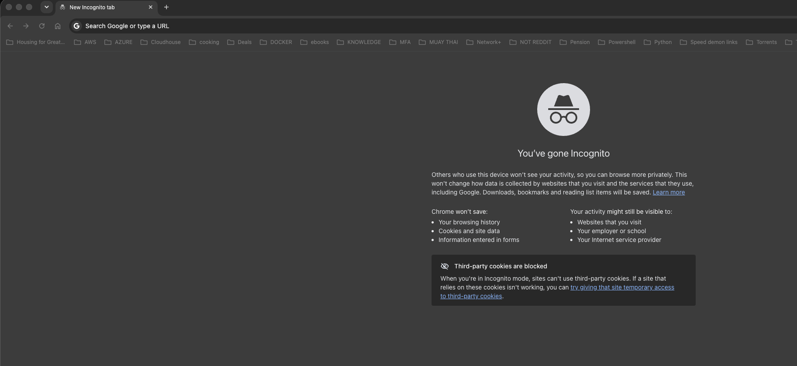
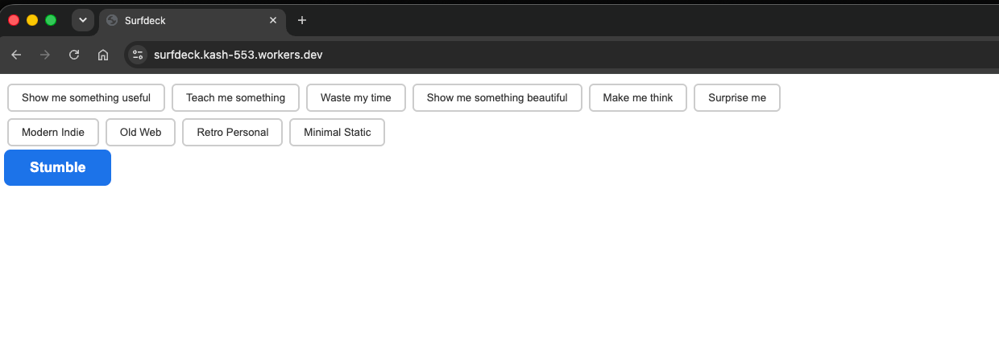
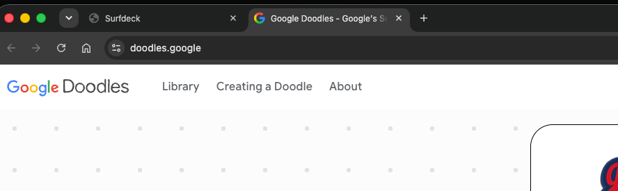
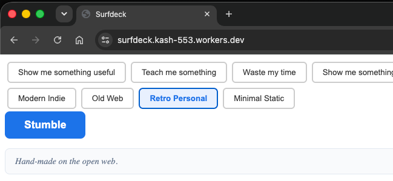
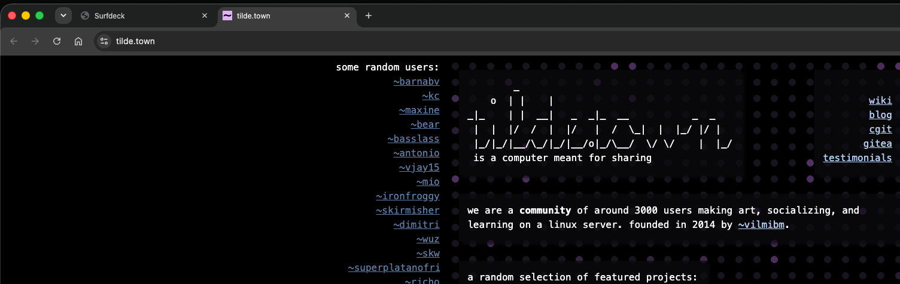
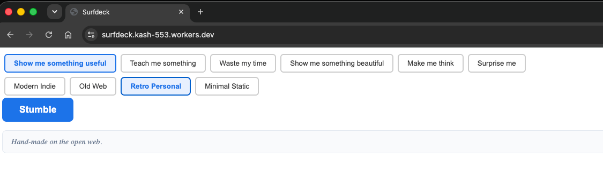
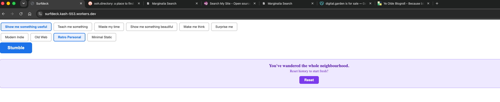
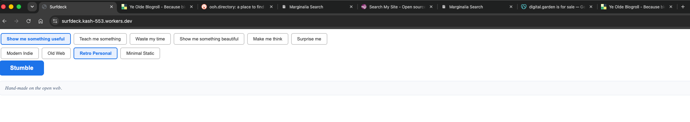

## 2026-08-20 — Post-MVP expansion: the surf rename

*With the 12-task MVP shipped and live, the remaining credits go to a rubric-grounded expansion — planned deliberately (rename → provenance enrichment → vibecoded corner → hooks → tests → video), authored in Kiro, verified from outside. First cycle: the rename, done before any new feature so nothing gets built on the old name.*

**62 · Rename "stumble" → "surf" across the living product.** The core interaction shipped as "stumble," a nod to the StumbleUpon-era tools that inspired it — but the product is *Surfdeck*, and "surf" is both on-brand and a cleaner story: *the tools that let us stumble the '90s web, but there's so much now it's more like surfing.* (The trademark risk of the generic verb was low; the rename is really about brand consistency and a better origin line for the README/video.) Kiro ran it as a refactor of shipped code, not a new spec: a context-gatherer sub-agent scoped every reference first, then it created the renamed files (`engine/surf.ts`, `routes/surf.ts` + tests, `SurfButton.tsx`), rewrote the identifiers (`surf`/`SurfParams`/`SurfResult`, `surfRoute`), moved the API route `/api/stumble` → `/api/surf` (client fetch and worker router together), updated the copy ("Surf" / "Surfing…" / "Hit Surf again"), fixed the trailing references in `index.ts`/`App.tsx`/`StatusMessage.tsx`/`ProvenanceCard.tsx`, and **deleted all five old `stumble.*` files** — then a one-line follow-up cleaned up two comments that still said "stumble." Deliberately left as history: `.kiro/specs/mvp-stumble/` (the MVP's honest build record — the folder is not renamed, which also avoids disturbing Kiro's spec tracking) and the `surfdeck_seen` localStorage key. Verification from disk caught nothing broken but confirmed the things the test suite can't: no orphaned `stumble.*` files, zero residual *verb* references (the 13 remaining `stumble` hits are all the spec **name** `mvp-stumble`, correctly kept), and — after Kiro's "both comments updated / 1 file changed" counter mismatch — that git really did modify both files. `tsc` clean, 42/42, build both environments. Client and worker redeployed **together** (the endpoint moved, and only the SPA calls it), then live-verified in production: `/api/surf` returns real rows, `/api/stumble` now 404s, and the freshly deployed client bundle calls `api/surf` with no `stumble` left. 6.54 + 0.57 credits.

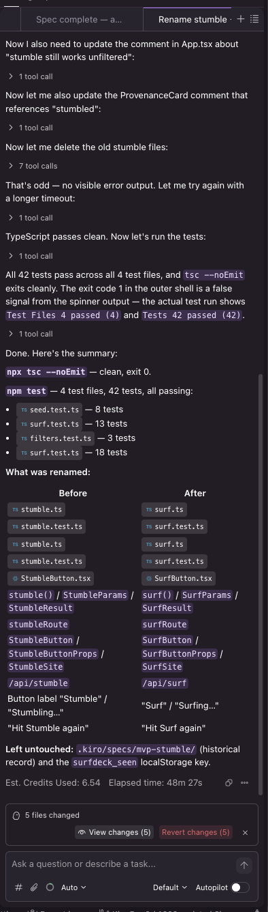

## 2026-08-20 — Post-MVP expansion: provenance enrichment (Cycle 2, the flagship)

*The rename cleared the way; this is the flagship. The MVP shipped "provenance-ready" — nullable `stack`/`host`/`static_or_dynamic` columns, a blank-tolerant ProvenanceCard, a `/api/filters` endpoint that hides empties — but all 288 rows are blank, so every card reads "Hand-made on the open web." and the build-filter row is invisible. Cycle 2 fills real, human-verified provenance for a demo subset, lighting up the build filters and the cards. Designed as a Kiro spec, authored in Kiro, verified from outside.*

**63 · Cycle 2 opens — the provenance-enrichment spec, authored in Kiro, with three human corrections caught before task execution.** Unlike the rename (a refactor), this ran as a full spec: Kiro read `reference/provenance-rules.md`, `reference/featured-sites.schema.md`, and `reference/tag-vocabulary.md`, gathered codebase context through a `context-gatherer` sub-agent (the existing seed logic, the empty BuildFilter/ProvenanceCard), then wrote `requirements.md` (13 requirements, EARS-style), `design.md` (offline detector architecture, priority-ordered detection-rule tables, the UPSERT SQL, the `PROVENANCE_LABELS` map, 8 fixture-test scenarios), and `tasks.md` (15 sub-tasks across 8 groups, with a hard STOP gate before any CSV write). The steering pattern held — the detector is deliberately a build-time dev tool, never deployed, so a wrong detection can only ever produce a blank card, never a broken surf. Each of the three docs was read from disk and reviewed, and three real issues were sent back before design/tasks could build on them: (1) **Req 5.1 had silently dropped `surge` and `firebase`** from the host controlled vocabulary in `provenance-rules.md` §3 — any Surge- or Firebase-hosted site would have been mis-blanked; both restored with their CNAME signals. (2) **No requirement governed the approval-to-CSV write step** — the whole human-in-the-middle integrity gate was only implied in prose; added as **Req 13, the Approval-to-CSV Write Gate**, defining it as an operation separate from the detector that writes *only* reviewer-approved, at-least-MEDIUM values, and names the demo-coverage aim (several stacks, several hosts, both static and dynamic, at least one value rare enough to make the zero-match state reachable on camera). (3) **Honouring `robots.txt` needs its own request**, which collided with the "one HEAD + one GET per URL" budget — clarified as an additional per-domain fetch cached separately in `.provenance-cache/robots/<domain>.txt`. Kiro applied all three and propagated them cleanly — the design's host table grew to 12 rules, `PROVENANCE_LABELS` gained both hosts, and tasks 8.1 and 3.1 were updated — re-verified from disk. Human direction shaping an AI-authored spec before it hardens into code: exactly the reviewed-work the rules reward. ~7 credits across spec + corrections.

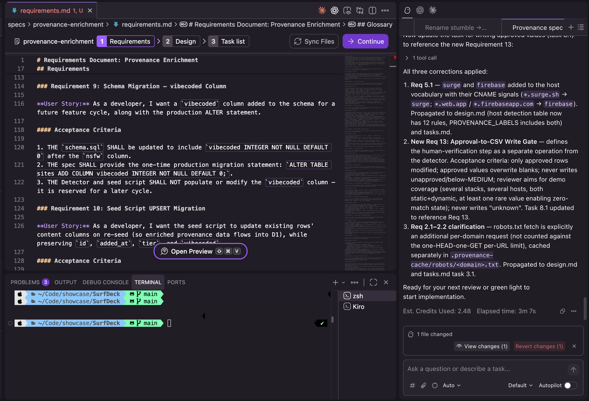

**64 · Task 1 — schema `vibecoded` column, cache gitignore, and the one new dependency.** The first code of the cycle, all setup. Kiro added `vibecoded INTEGER NOT NULL DEFAULT 0` immediately after `nsfw` in `schema.sql` and documented the one-time production migration — `ALTER TABLE sites ADD COLUMN vibecoded INTEGER NOT NULL DEFAULT 0;` — as a comment at the top of the file, appended `.provenance-cache/` to `.gitignore`, and installed `robots-parser@3.0.1` exact-pinned. The `vibecoded` column rides along in *this* cycle deliberately: it's reserved for the later vibecoded-corner cycle and nothing reads or writes it yet, but adding it now (schema-only, default 0) means that cycle needs no second `ALTER` against live prod. Kiro's "already in place" narration on the sub-tasks was, unusually, accurate — but verified from disk rather than taken on its word: `schema.sql` carries the column in the right position and the ALTER comment; `.gitignore` has the cache dir; `package.json` pins `robots-parser` at an exact `3.0.1` with no range prefix. `tsc --noEmit` clean and the suite unchanged at 42/42 (no behaviour yet — this is scaffolding). Parent task 1 closed. ~2.4 credits. Next: task 2, the pure detection rule set and its fixture tests — the heart of the detector.

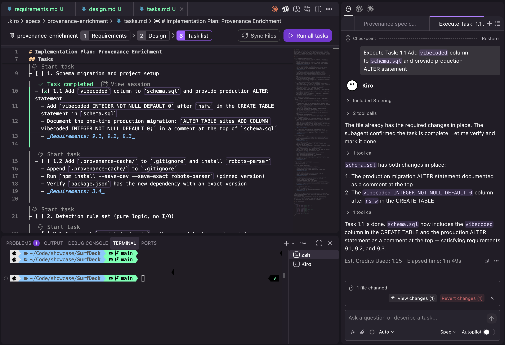

**65 · Task 2 — the detection rule set and its 8 fixture tests, the brain of the detector.** The pure-logic core (`scripts/rules.ts`), authored via a `spec-task-execution` sub-agent and split cleanly from all I/O so it's testable in isolation: `detectStack` (11 HIGH-confidence HTML-fingerprint rules in strict priority order — `__NEXT_DATA__`, generator metas, framework asset paths — plus 4 MEDIUM fallbacks), `detectHost` (12 header/DNS-CNAME rules), and `detectStaticOrDynamic` (a composite +1/-1 tally of five static and five dynamic signals). Every trap the design named is implemented and, more importantly, *tested to fail without it* — `rules.test.ts` carries all 8 fixtures: **CF-Ray + `Server: cloudflare` with no `*.pages.dev` CNAME asserts `host === ""`** (Cloudflare is a proxy, never a host); **`__NEXT_DATA__` + `Set-Cookie` + `Cache-Control: no-store` asserts `sod === "dynamic"`** (framework ≠ rendering mode); WordPress→dynamic; Netlify→static; a minimal semantic page→`static_html`; an ambiguous nginx+conflicting-signals page→blank host and blank sod. Read from disk rather than trusted: `rules.ts` matches the design's rule tables line-for-line, the guards on the MEDIUM SPA rules are correct, surge/firebase/heroku are all present. `npx tsc --noEmit` clean and the suite went **42 → 50, all green**. Parent task 2 closed. One limitation logged honestly for the report-review gate (task 7.2), where it's caught by design: `static_html`/`static` are assigned somewhat eagerly — a framework-less-looking page (an Eleventy or Zola build with clean output) can be labeled `static_html` MEDIUM on what is really absence-of-evidence, so those are the calls to scrutinise hardest before any value is written to the CSV. It's MEDIUM confidence and human-gated precisely for this reason. ~3.4 + 3.0 credits (2.1 + 2.2). Next: task 3, the detector's I/O layer — fetcher, cache, and report emitter.

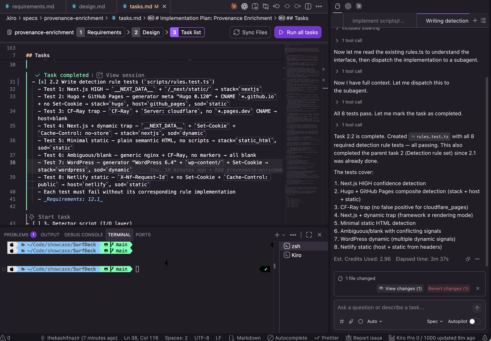

**66 · Task 3 — the detector's I/O layer, wrapping the pure rules in a polite fetcher, cache, and report emitter.** `scripts/detect-provenance.ts` (545 lines, authored via the `spec-task-execution` sub-agent) is everything the rule set is not: the side-effecting shell. It reads URLs by **reusing** `parseCSV` + `buildColIndex` from `seed-logic.ts` (no parser duplication), and for each site checks a per-URL disk cache keyed by `sha256(url)`; on a miss it fetches `robots.txt` once per domain (cached separately, honoured via `robots-parser`), then one HEAD + one GET (10s timeout, body truncated at 500KB), resolves the DNS CNAME, and caches the bundle — all under a 2-concurrent / 500ms-spaced rate limiter with a `SurfdeckBot/0.1` UA and no retries. Every failure path fails open to an all-blank row with an evidence note (`robots.txt disallowed`, `HTTP {status}`, `unreachable`). It calls `detectProvenance()` and — the piece deferred from the rule module — computes the **row-level confidence as the minimum of the non-blank field confidences** (HIGH only when every detected field is HIGH), then writes `data/provenance-report.md` sorted HIGH→MEDIUM→blank with summary stats. Crucially, it **reads the CSV but never writes it** — the human gate stays intact. Read from disk and type-checked: `tsc --noEmit` clean, suite unchanged at 50/50. The honest boundary: this task *implements* the detector; it has not yet touched the network — the concurrency limiter and fetch paths get their real exercise at task 7.1, and the row confidence is validated there against live output. Two cosmetic notes logged (the unused `"LOW"` confidence value; robots-disallowed evidence degrading to "unreachable" on a cached re-run) — neither affects a label, both blank correctly. Parent task 3 closed. ~5 credits. Next: task 4, the seed UPSERT migration that lets a reseed actually push enriched provenance into the existing rows.

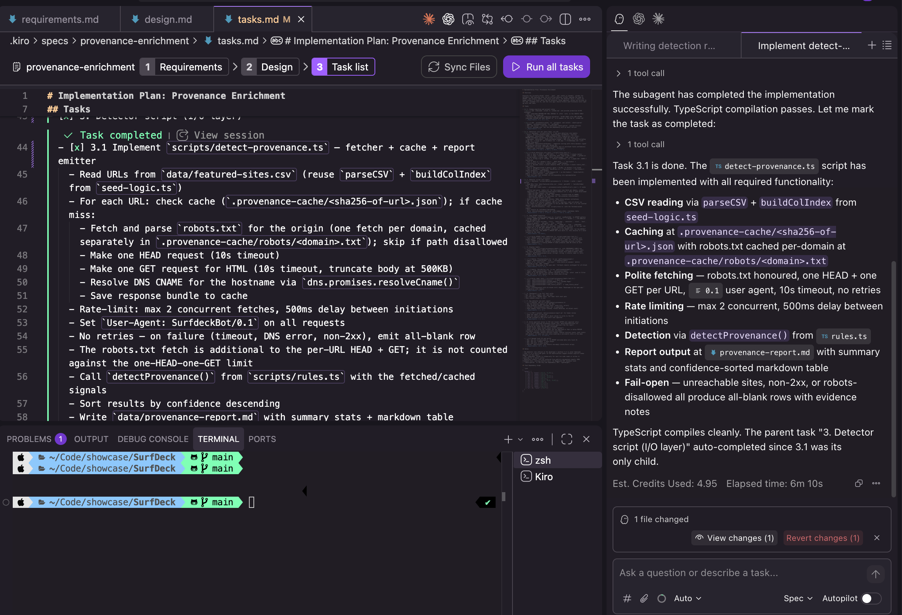

**67 · Task 4 — the seed UPSERT migration, and the test that makes "non-destructive" a fact instead of a claim.** `seedRowToSQL` in `seed-logic.ts` switches from `INSERT OR IGNORE` to `INSERT ... ON CONFLICT(url) DO UPDATE SET` — so a reseed now actually pushes enriched provenance into the 288 rows that already exist (the old `INSERT OR IGNORE` silently skipped them). The UPDATE SET lists only the nine content columns and deliberately **omits `id`, `added_at`, `tier`, and `vibecoded`**; `vibecoded` is also absent from the INSERT list, so `DEFAULT 0` handles new rows and nothing ever touches it. The migration's whole promise is that a reseed doesn't churn the original `added_at` timestamps — and Kiro made that testable rather than asserted: for task 4.2 it added `better-sqlite3` (an in-memory build of the same SQLite engine D1 runs) as a pinned dev dependency and wrote three genuine DB-level integration tests — insert-blank-then-reinsert-`nextjs` (same `id`, same `added_at`, one row); **re-seed with a *later* timestamp and new content, assert `added_at` stays the original while `title`/`stack`/`host`/`static_or_dynamic` update**; and idempotency (five reseeds → one row, `vibecoded` still 0). The middle test fails the instant `added_at` sneaks into the UPDATE SET. This is a deliberate deviation from the design (which suggested wrangler-D1-local for these tests) to something faster and deterministic; the cost is a native dev-dep, but it ships prebuilt binaries and loaded without compiling, so a judge's `npm install` stays clean. Also updated `seed.test.ts`'s three SQL-generation property tests to expect the new UPSERT shape. Verified from disk: the SQL is correct, `added_at` is out of the UPDATE SET, and the tests really re-seed a live row to prove preservation. `tsc --noEmit` clean, suite **50 → 53 across 6 files**. Parent task 4 closed. ~3.9 + 2.4 credits. Next: task 5, the render-only display labels that turn `nextjs` into "Next.js" on screen.

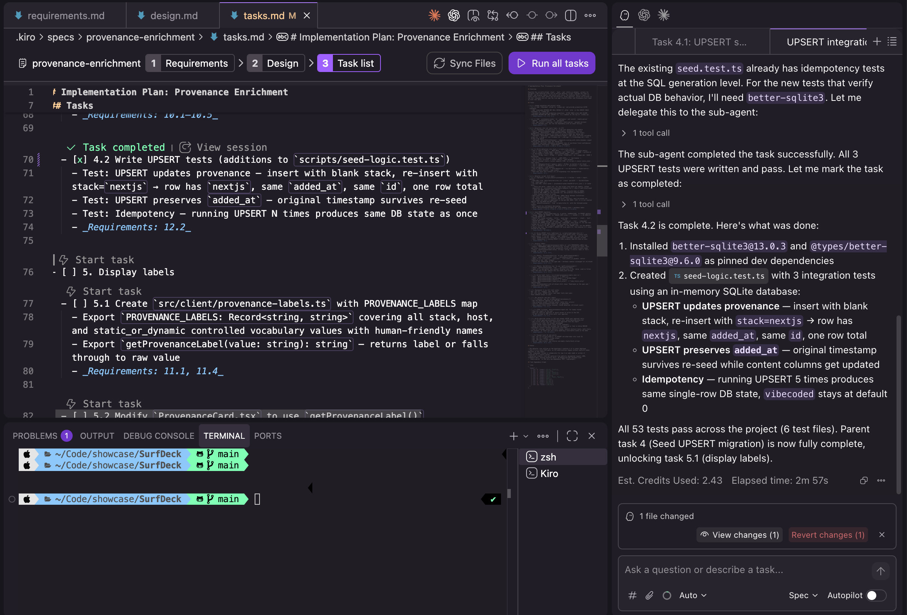

**68 · Task 5 — render-only display labels, so the flagship reads "Next.js · Vercel · Static" instead of `nextjs · vercel · static`.** A new `src/client/provenance-labels.ts` holds a 32-entry `PROVENANCE_LABELS` map (every stack, host, and static/dynamic controlled-vocabulary value) and `getProvenanceLabel(value)`, which returns the pretty label or falls through to the raw value for any unknown key. It's wired into both display surfaces across three sub-tasks: `ProvenanceCard` applies it in the `<dd>`, and `BuildFilter` applies it to each button's text. The whole correctness of this task is one boundary — it must be **render-only** — and it holds: in `ProvenanceCard`, `isDisplayable()` still runs against the *raw* value (so blank and "unknown" are excluded before any labelling, and the "Hand-made on the open web." fallback is byte-for-byte unchanged); in `BuildFilter`, the button's `key`, `onClick → handleToggle`, `aria-pressed`, and the selection membership test all still use the raw snake_case `value`, and only the visible text is `getProvenanceLabel(value)` — so `/api/filters` and every filter payload keep operating on the stored keys. Verified from disk (both components, both boundaries) rather than on Kiro's "already applied" narration. `provenance-labels.test.ts` adds 7 tests: known keys → pretty, unknown → passthrough, and a ProvenanceCard-level check that all-blank still yields the fallback. One honest limitation logged: the project has no `@testing-library/react`/`jsdom`, so that "integration" test is logic-level (empty string passes through as empty), not a DOM render — appropriate for the setup, with the real render eyeballed live at the enrichment reveal. `tsc --noEmit` clean, suite **53 → 60 across 7 files**. Parent task 5 closed. ~1.8 + 1.9 + 1.4 + 1.7 credits. The entire build side of the flagship is now done — detector, migration, and UI are all in place and green. Next: task 6, the checkpoint, then task 7 — the first live run of the detector against all 288 sites and the hard-stop report review.

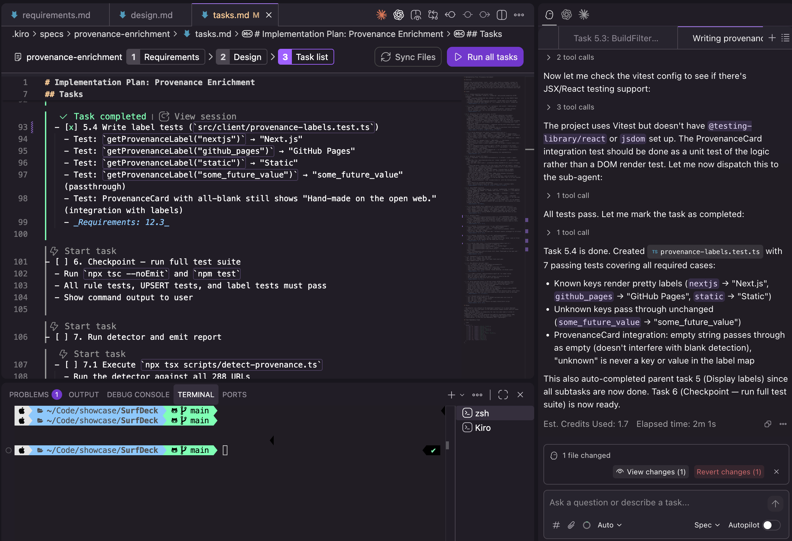

**69 · Task 6 checkpoint + task 7.1 — the detector's first live run against all 288 sites.** The checkpoint was clean (60/60 across 7 files, tsc 0 errors), then the detector actually ran: **288 scanned, 259 detected at least one field, 29 all-blank**, and a `data/provenance-report.md` (295 lines) sorted by confidence. Kiro reported "285 cache hits / 3 fresh fetches" — the detector had been exercised earlier in the build, so its gitignored cache was warm and this run rebuilt the report mostly from responses already fetched from the live sites today; the data is real, just not all pulled this minute. The confidence split: **70 HIGH, 189 MEDIUM, 29 blank**. The HIGH block is exactly what it should be — hard framework fingerprints and host headers you can't fake by accident: `__NEXT_DATA__` + `X-Vercel-Id` (aeon.co, joshwcomeau.com, ray.so, psyche.co, tylerxhobbs.com…), `generator "Hugo"` (jvns.ca, craigmod.com, sourcehut.org), `generator "WordPress"` + `wp-content/` (pluralistic.net, waxy.org, kk.org, filfre.net), `generator "Astro"` + `/_astro/` (longnow.org, maggieappleton.com), `/_nuxt/` (neal.fun), `/_app/immutable/` + SvelteKit (pudding.cool on AWS S3, mermaid.live on GitHub Pages), `id="___gatsby"` (earth.fm, untools.co), `generator "Jekyll"` (512kb.club), `generator "Ghost"` (blog.codinghorror.com), and one clean dynamic call — nautil.us (Next.js + `Set-Cookie` + `no-store`). Across the corpus: stacks nextjs 16 / wordpress 9 / hugo 6 / astro 3 / sveltekit 2 / gatsby 2 / nuxt · jekyll · ghost 1 each, plus **static_html 184**; hosts github_pages 21 / netlify 19 / vercel 12 / aws_s3 6 / render · fly 1 each; static 192 / dynamic 9. That `static_html` 184 is the eager absence-of-markers call the design flagged — 64% of the corpus — so it's the pile to scrutinise, not trust. The run stopped at task 7.2, the **human review gate**: no value reaches the CSV until the proposed labels are reviewed and a curated subset is explicitly approved. That review is next, done from the report with a bias toward the HIGH rows and a skeptical eye on the `static_html` MEDIUM mass. ~2.2 + 4 credits. Next: pick the coverage-diverse ~30, then task 8 writes only those to the CSV and reseeds.

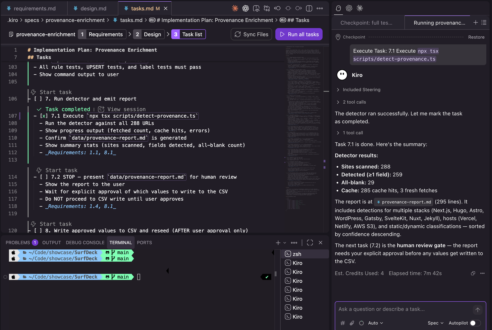

**70 · Task 8 + close-out — the enrichment lands, and Surfdeck's personality goes live.** The human-review gate resolved to a clean rule: **approve every row with hard evidence — HIGH confidence OR a positively-detected host — and leave the ~150 hostless `static_html` guesses blank.** Kiro's own approval dialog independently converged on the same line ("all HIGH + MEDIUM with confirmed host — most coverage, least risk"), which is a nice validation that the rule wasn't arbitrary. Task 8.1 wrote **107 rows** into `data/featured-sites.csv`, transcribing values verbatim from the report. That write was verified from disk field-by-field against the pre-enrichment CSV rather than trusted: **107 rows changed, zero non-provenance values altered** (the CSV writer re-quoted `"The 1MB Club"` and friends, but changed no actual value — the RFC-4180 parser handles either style, which is why all 60 tests still passed), **zero unapproved rows**, and **every written value matching `provenance-report.md` exactly**. The result covers 11 distinct stacks, 6 hosts, both static and dynamic, and singleton values (`jekyll`/`nuxt`/`react_spa`/`ghost`/`fly`/`render`) that make the zero-match UI state reachable. Task 8.2 reseeded local D1 (288 rows) with tsc clean and 60/60 green — though Kiro then burned seven attempts looping on a dev-server probe of `/api/filters` before it was cancelled; that check belonged outside the tool anyway.

The remote close-out ran from the copilot's shell (with the two production *writes* explicitly hand-run in the terminal, since the harness rightly refuses to auto-execute a 288-statement prod write): the one-time migration `ALTER TABLE sites ADD COLUMN vibecoded INTEGER NOT NULL DEFAULT 0` on prod, then a `--remote` reseed. Every claim was checked against production state, not the seed's stdout (whose "INSERT OR IGNORE" completion line is a stale log string — the real SQL is the UPSERT, and its **576 rows written** across 288 statements is the tell that existing rows were genuinely *updated*, not skipped). Live prod D1 afterwards: **76 rows with a stack, 60 with a host, 11 distinct stacks, 6 distinct hosts**, `vibecoded` present and all-zero, and — the whole point of the non-destructive design — **`added_at` unchanged** on every sampled row (`joshwcomeau.com`→`nextjs`/`vercel`, `neal.fun`→`nuxt`, `512kb.club`→`jekyll`, all still stamped `2026-08-20T09:11:45.121Z`). A rebuild-then-deploy shipped the display-label client; the live site now serves the new bundle, and production `GET /api/filters` returns the full set: **11 stacks, 6 hosts, static + dynamic**. The build-filter row — invisible for the entire life of the project because the corpus was blank — is finally populated on the open web, ProvenanceCards on 107 sites now read `Next.js · Vercel · Static` instead of the fallback, and the zero-match state is reachable for the first time. ~5.6 credits (task 8) + the close-out. The flagship is done. Next: the vibecoded corner (cycle 3), the deferred tests, hooks, and the README + demo video on the finished product.

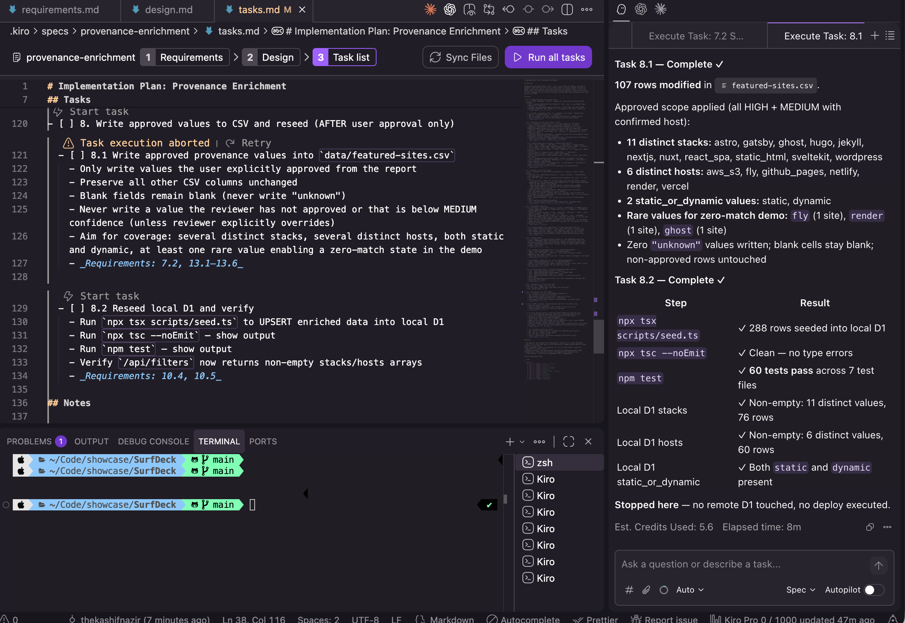
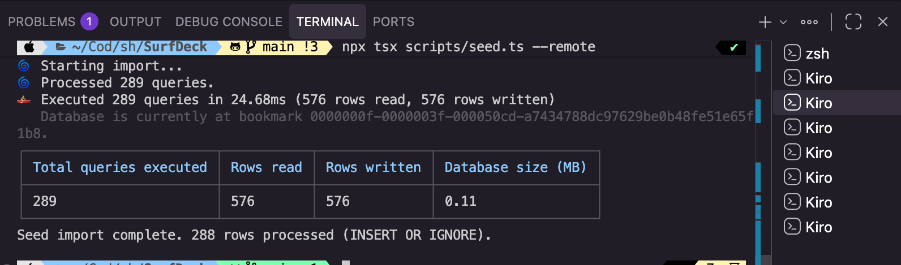

**71 · The flagship, witnessed live in a logged-out browser.** Everything above is proven at the data and API layer; this is the payoff seen the way a stranger meets it, on the deployed `surfdeck.kash-553.workers.dev`. The build-filter row — invisible for the entire life of the project — now renders in full: **Stack** (Astro, Gatsby, Ghost, Hugo, Jekyll, Next.js, Nuxt, React SPA, Static HTML, SvelteKit, WordPress), **Hosted on** (AWS S3, Fly.io, GitHub Pages, Netlify, Render, Vercel), and **Type** (Static, Dynamic) — all reading as clean display labels, not raw `snake_case`. Filtering to **React SPA** surfed to `sha256algorithm.com` with a real ProvenanceCard reading **React SPA · Netlify · Static**; **Netlify** surfed to Smashing Magazine (**Static HTML · Netlify · Static**); **Dynamic** surfed to `nautil.us` (**Next.js · Dynamic**). And the zero-match state, unreachable through the UI until this cycle, was reached honestly: **GitHub Pages + Dynamic → "Nothing in that corner right now. Loosen a filter and try again."** A nice truth surfaced while exploring: the detector found exactly **one** dynamic site (nautil.us, host masked) because it conservatively prefers blank over guessing dynamic — so *Dynamic + any host* is legitimately empty, another honest empty corner rather than a bug. The spec's own tracking was tidied at the end (tasks 8 / 8.1 / 8.2 ticked in `tasks.md` after the earlier dev-server loop had aborted before the checkboxes flipped). Cycle 2 is complete, verified in production, and human-witnessed end to end.

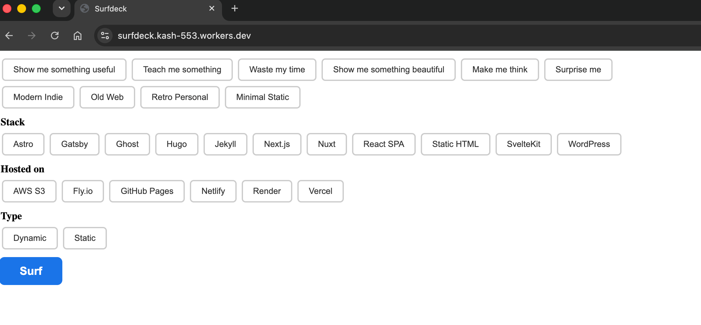
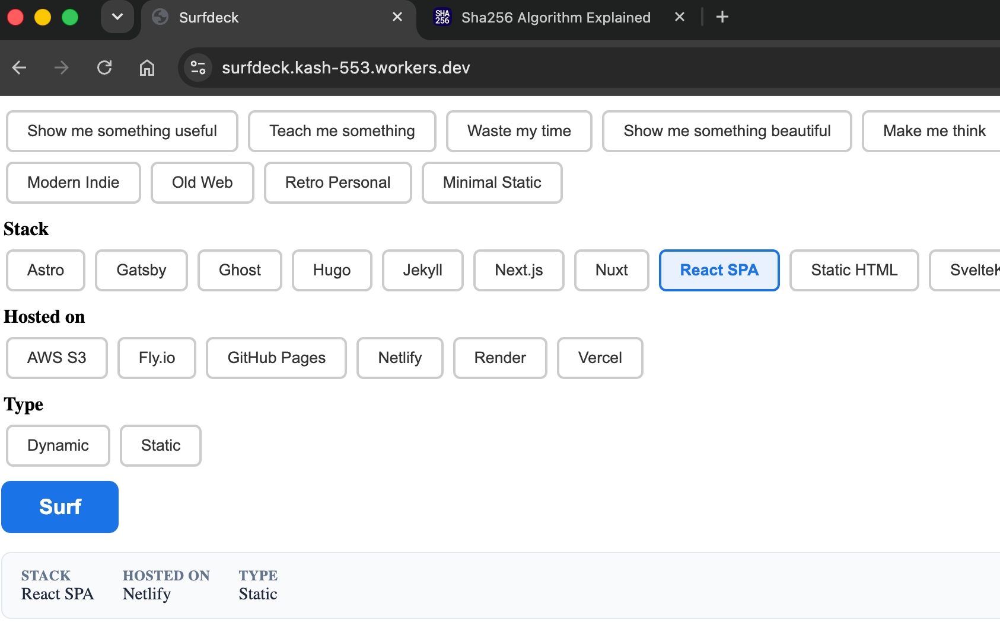
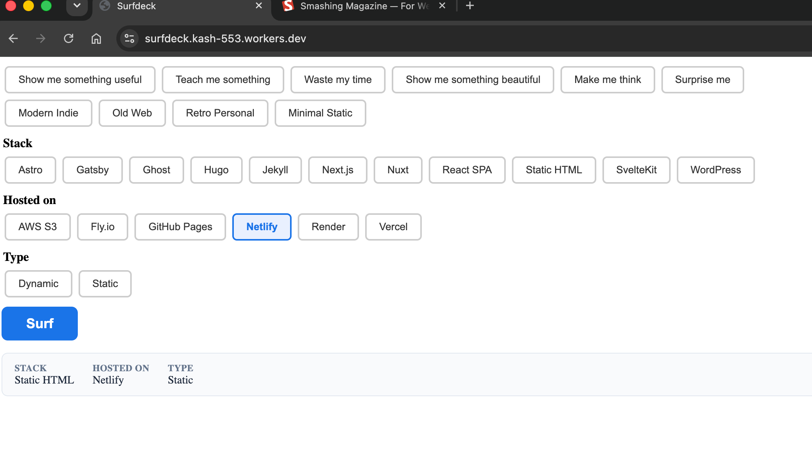

**72 · Cycle 3 opens — the vibecoded-corner spec, a real fourth Kiro pillar (Playwright MCP), and the backend foundation through the engine partition.** Cycle 2 made the *provenance* thesis real (what a site is built **of**); Cycle 3 makes the **originality** thesis real — a distinct surf mode holding only genuinely AI-built sites, with Surfdeck itself as exhibit #1. It ran as a full spec at `.kiro/specs/vibecoded-corner/` (requirements → design → tasks, 8 waves), reviewed from disk before any code. Four refinements were sent back and each applied + re-verified from disk: (a) the tier map became **one shared source** — `src/shared/vibecoded-tiers.ts` — with the reverse map *derived programmatically*, not hand-copied; (b) the build filters are **hidden inside the corner** (only mood/character/tier apply there); (c) the CSV migration pads **all 288 existing rows** with the new columns plus a column-count check; (d) the ouroboros link points at the real repo. That last one caught a genuine hallucination before it committed: Kiro had written the exhibit's link as `github.com/anthropics/surfdeck` — a plausible-looking but wrong URL — corrected to `github.com/thekashifnazir/surfdeck`. Disk-verification, not narration-trust, is what surfaced it.

The cycle also completes the four-pillar Kiro set (Specs, Steering, Hooks, MCP) with a pillar that does real work rather than checking a box. A plain fetch MCP would have been decorative — Kiro ships a built-in `web_fetch` — so the committed `.kiro/settings/mcp.json` wires the **Microsoft Playwright MCP** (`@playwright/mcp` via `npx`, fully local, **zero credentials → nothing secret in the committed file**), which does what built-in fetch cannot: render JS-SPA galleries and screenshot-verify each candidate during the later vetting gate. A steering doc `.kiro/steering/vibecoded-taxonomy.md` carries the 4-tier ladder, the `built_with` vocabulary, and the "we vouch per-site; builder badges are removable, so auto-detection is a hint, never proof" curation rule.

The backend foundation then landed across three task groups, each verified from disk and gated fresh rather than trusted. **Task 1 (schema/seed/CSV):** `built_with TEXT` added to `schema.sql` after `vibecoded` with the one-time prod `ALTER` documented; the seed UPSERT gained `built_with` **and** `vibecoded` in its content set while `id`/`added_at`/`tier` stay out of the UPDATE (added_at must never churn); the CSV grew to 12 columns with all 288 rows padded blank/0; `.vibecoded-cache/` gitignored. **Task 2 (label & tier map):** the single-source module exports the forward `BUILT_WITH_TIER`, a `TIER_TO_BUILT_WITH` **derived** via `Object.entries().reduce()` (so the two can never drift), `expandTiers`, and the getters — and it is DOM-free, so both sides import it: `src/client/vibecoded-labels.ts` re-exports the tier logic and *adds* the display-only `BUILT_WITH_LABELS` (labels never reach the Worker), and `src/worker/engine/tier-map.ts` is a pure re-export with no hand-maintained copies. A grep confirms both consumers point at the one file; 10 map tests cover known→pretty, unknown→passthrough-no-crash, and the derived expansion. **Task 3 (engine + API):** `surf()` gained an **unconditional** vibecoded partition — every query pushes either `vibecoded = 1` (corner) or `vibecoded = 0` (open web), so neither world can ever leak into the other — plus a tier filter that expands via the shared `expandTiers()` and forces `1 = 0` (an honest no_match) when every requested tier is unknown, rather than silently widening to the whole corner. The seen-list inlined-integer `NOT IN` pattern (the D1 no-bound-params fix from the MVP) survived the new clauses untouched. `/api/surf` parses `vibecoded=1` and a comma-separated `tier` param (ignored unless in corner mode) and returns `built_with`; `/api/filters` adds a 4th parallel D1 query for distinct `built_with` where `vibecoded=1`, deriving `corner_tiers` from the shared tier map. Fourteen new property tests assert default-surf-excludes-corner, corner-returns-only-corner, tier-narrowing, the all-unknown-tier no_match, and that every open-web path (seen/no_match/exhausted) still holds. Fresh gate at the checkpoint: `tsc --noEmit` exit 0, **84 tests across 8 files**, all green.

The honest boundary: the corner is *wired but empty*. The CSV carries only the 288 padded open-web rows (all `vibecoded=0`); no AI-built site exists in the corpus yet. Those rows are written only at task 7, after the Playwright MCP renders and screenshot-verifies the proposed ~51-site seed list and a human approves a curated ~50–60 — the same approval-to-CSV gate as Cycle 2. Still ahead this cycle: the corner UI and the `/ouroboros` colophon page (task 4–5), the Certificate-Transparency discovery sampler (task 6), the vetting gate (task 7), and the reseed + redeploy (task 8). This commit is the spec + backend foundation, committed to the trunk at the first green checkpoint.

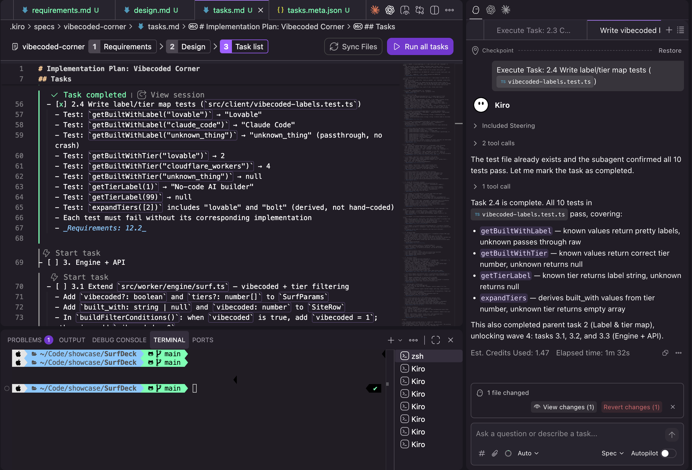
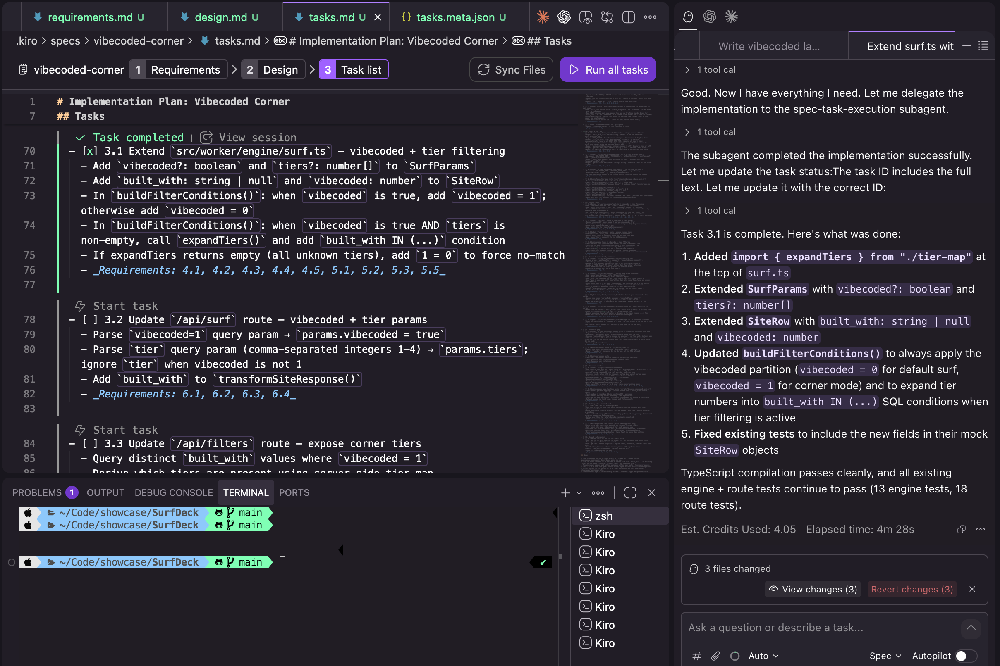
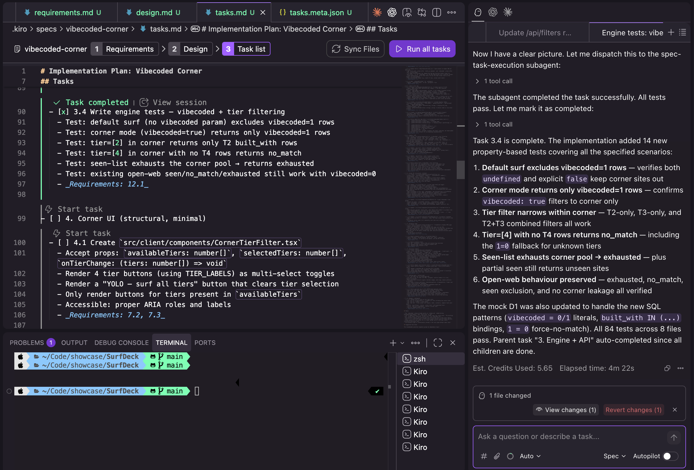

**73 · Tasks 4 + 5 — the Corner UI and the ouroboros colophon, the parts a visitor actually touches.** With the backend partition proven, the cycle built the surfaces on top of it. **Task 4 (Corner UI)** wired five components, each verified from disk against the render-only and no-rarity-code boundaries rather than on Kiro's "already implemented" narration (which recurred here — several sub-tasks reported the code was already in place, so every claim was independently read). `CornerTierFilter.tsx` renders one multi-select button per *available* tier (from `TIER_LABELS`) plus a "YOLO — surf all tiers" button that clears the selection, with `role="group"` and `aria-pressed`. `App.tsx` gained `cornerMode` state and the toggle: `{!cornerMode && <BuildFilter/>}` hides the stack/host/type filters inside the corner while mood and character stay visible, `{cornerMode && <CornerTierFilter/>}` shows the tier axis, and an "Enter the Vibecoded Corner" / "← Back to open-web surf" pair flips between the two worlds — the UI's "distinct place" mirroring the engine's unconditional `WHERE vibecoded = ?`. `SurfButton.tsx` now appends `&vibecoded=1` (and `&tier=2,3` when tiers are selected in corner mode) to the API URL. The two display components hold the boundaries that matter: `ProvenanceCard.tsx` leads with the builder for vibecoded sites — primary "Built with {label}" via `getBuiltWithLabel`, secondary "{tierLabel} · Tier N" (gracefully omitted when the tier is unknown), the existing stack/host/type demoted to a tertiary italic "(runs: …)" line — while branching on the **raw** `built_with` value (labels touch only display text) and leaving the "Hand-made on the open web." fallback byte-for-byte unchanged for the 288 open-web rows; `StatusMessage.tsx` shows "The loop closes — you surfed to the surfer." purely when `status === "ok" && siteUrl === "/ouroboros"`, checked *before* the generic ok-renders-nothing branch (swap that order and the message would never fire) — and with **no rarity code**: it is rare because Surfdeck is one row in the pool, not because anything counts. The corner toggle was rendered live in `vite dev` to confirm the two modes actually swap on screen. No new tests this wave — task 4 is structural UI; the behavioural tests already live in the engine/map suites, and the routing test comes with task 5.

**Task 5 (Ouroboros page)** added the self-referential heart. `src/worker/routes/ouroboros.ts` exports a Hono router serving `GET /ouroboros` as a **standalone** HTML colophon (not the SPA), carrying the Req 9.2 text verbatim — "You're inside the app you're surfing with. Surfdeck was built end-to-end by AI in Kiro — exhibit #1 in its own vibecoded corner." — a link to the real public repo (`github.com/thekashifnazir/surfdeck`, *not* the `anthropics/surfdeck` Kiro had hallucinated back at spec time, which held fixed), and a placeholder glyph noted for the Cycle-4 design pass. The critical seam is the mount order in `index.ts`: `app.route("", ouroborosRoute)` is registered **first**, ahead of the `/api` routes and the `/api/*` 404 catch-all, so the Worker serves `/ouroboros` directly. `ouroboros.test.ts` adds 3 tests (200 + `text/html`; body contains the colophon text; body contains the repo link), taking the suite to **87 across 9 files**, `tsc` clean. One honest boundary logged for the deploy step: those tests exercise the Hono handler in isolation, which proves the *handler* is correct but **not** that a production request to `/ouroboros` reaches the Worker rather than being intercepted by the Cloudflare Assets SPA fallback (`not_found_handling: single-page-application`) and served `index.html` — that Worker-vs-Assets interaction is only truly provable against the live edge, so it is a must-curl-live check at deploy (task 8), alongside the still-pending fact that the corner has **no content until task 7** writes the vetted `vibecoded=1` rows. This commit bundles the Corner UI with the route it references so the `/ouroboros`-referencing StatusMessage and the route that serves it land atomically.

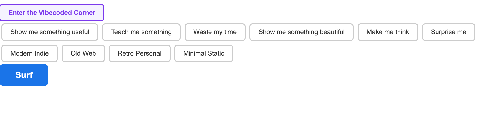
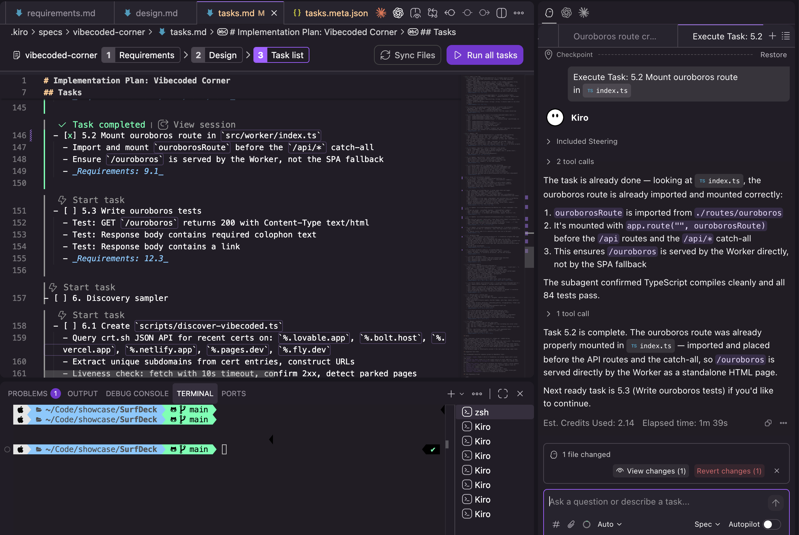
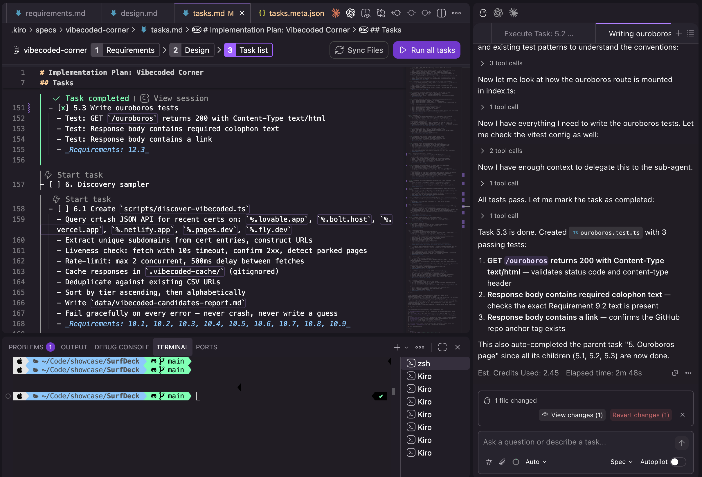

**74 · The ouroboros that wasn't there — a routing bug the unit tests couldn't see, caught in a browser.** After task 5 shipped "green" — 3 passing route tests, `tsc` clean, and a header-less `curl http://localhost:5173/ouroboros` that returned the colophon — a glance at the same URL *in an actual browser* showed the normal surf app, not the colophon. The two disagreed, and the browser was right. Root cause: `wrangler.jsonc` pairs `"compatibility_date": "2025-04-01"` with `"assets": { "not_found_handling": "single-page-application" }`, and Cloudflare's docs are explicit — at that compatibility date or later, a **navigation request** (one carrying `Sec-Fetch-Mode: navigate`, which every browser attaches when you visit a URL) to a path with no matching static asset is served `index.html` by the Assets system *before the Worker ever runs*. So the Hono `/ouroboros` route — mounted correctly first in `index.ts` back at task 5.2 — was unreachable for real visitors; **Requirement 9.1 ("served by the Worker, not the SPA fallback") was not actually satisfied**, the mount-order fix being necessary but not sufficient. The reason it hid so well is the reason it was worth writing down: the single header that distinguishes "a browser navigating" from "a script fetching" is the exact header the feature keys on, so `curl` and the isolated route tests sailed straight past it. **Lesson banked: to verify a user-facing route, send the headers a user's browser sends** (`Sec-Fetch-Mode: navigate`) — reproducing with those headers turned the colophon into the SPA shell on demand, and the vite dev server was never lying, it was faithfully emulating production.

The fix is one line Kiro authored in `wrangler.jsonc`: `"run_worker_first": ["/ouroboros"]`, which forces that path to the Worker ahead of the SPA fallback (`run_worker_first` accepts an array of route patterns in wrangler 4.124.0). Nothing else changed — no Worker code, no route, no test — and `tsc` stayed clean with the suite at 87. Verified from outside rather than on the config's word: the identical browser-navigation request that had returned `<title>Surfdeck</title>` + `id="root"` now returns `<title>Surfdeck — The Ouroboros</title>` + "The loop closes.", with zero SPA markers. That request runs against the real workerd + Assets emulation the CF Vite plugin stands up, so the same emulation that reproduced the bug now reproduces the fix — as decisive as it gets short of the live edge, which stays on the deploy checklist (task 8) as the final confirmation. This behaviour can't be pinned by a vitest unit (the route handler was always correct in isolation; the defect lived in the platform's asset-vs-Worker precedence, which only the real runtime exercises), so the browser-header request against the emulated runtime *is* the regression check, recorded here in lieu of a unit test. The ouroboros page's visuals stay a bare placeholder by choice — the real glyph and "you found the maker" treatment are deliberately deferred to the Cycle 4 design pass; this entry is only about making the distinct page actually reachable.

![The fix — run_worker_first: ["/ouroboros"] in wrangler.jsonc, tsc 0 + 87 tests green](screenshots/2026-08-20-84-ouroboros-routing-fix.png)
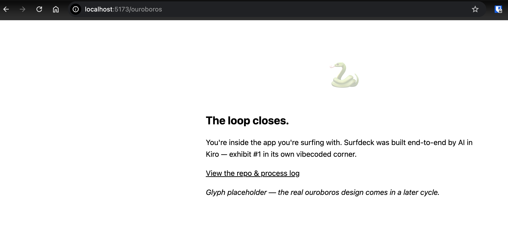
