# Kiro process log

Dated screenshots and notes of Kiro authoring this project: steering, specs, tasks, hooks.

## 2026-08-19 — Day 1

**01 · Fresh workspace, first open.** SurfDeck folder open in Kiro for the first time: `reference/` and `data/` present, no `.kiro/` yet, new chat session before any message sent.

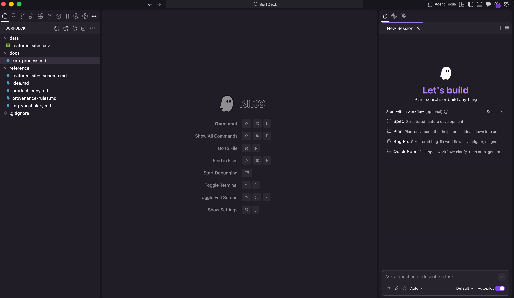

**02 · Ingestion play-back.** First message asked Kiro to read `reference/` and explain the project back without implementing. Its play-back matched the frozen contract on the first pass (stumble-not-feed, surprise-as-bypass, single-valued character, derived build filters, blank-not-error provenance); its one wrong assumption ("no database required") was corrected to the decided D1 stack in the follow-up.

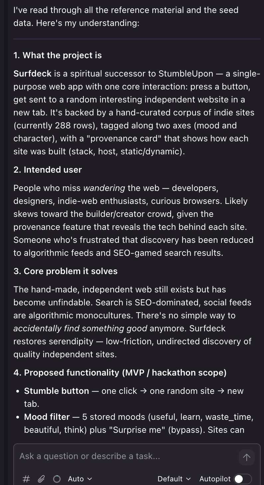

**03–04 · Steering generated, then corrected through chat.** "Project steering files" generated `product.md`/`tech.md`/`structure.md`. Review caught two gaps: product.md lacked the frozen mood-button copy, and tech.md claimed the frontend was undecided (it is: Vite + React + TS SPA + Hono on one Worker). Both corrected via chat and re-accepted — Kiro authored every line.

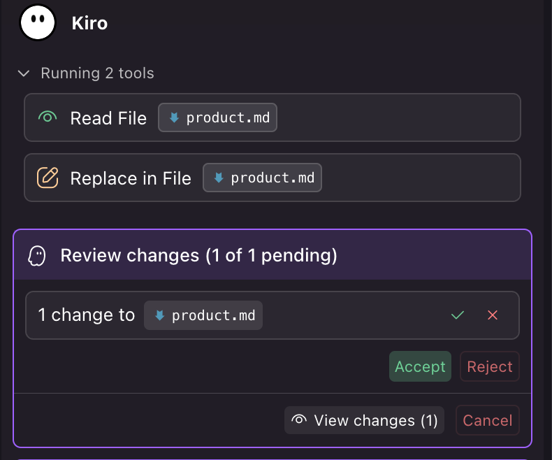
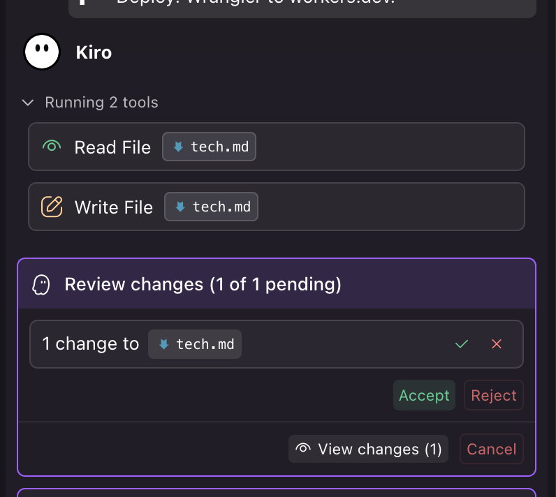

**05–06 · Requirements phase.** Spec `mvp-stumble` created (Requirements-First). First draft reviewed against the frozen contract: caught an internal contradiction (repeats permitted vs last-3 no-repeat) and replaced both with the decided session seen-list rule; added the exhausted state, NSFW guard, and frozen empty-state copy. Then ran Kiro's Analyze Requirements: answered 12 clarifying questions (rejecting speculative scope like component-failure fallbacks), and accepted 4 incorporated clarifications (popup-blocker notice, network-timeout abort, atomic seed rows, API 5xx-as-JSON). Final doc: 12 requirements in EARS form.

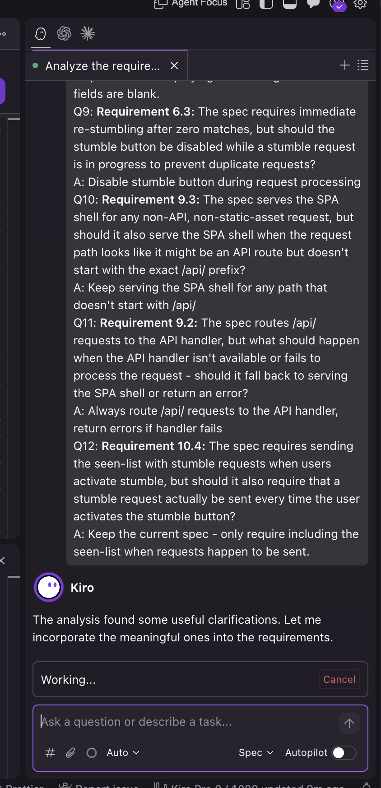
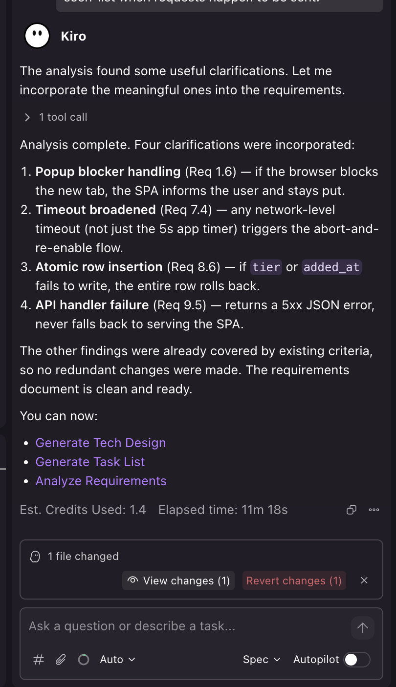

**07–08 · Design phase.** Generated `design.md`: single Worker (Hono + Workers Assets), D1 schema mapped from the CSV contract, distinct `no_match`/`exhausted` API statuses, 11 correctness properties traced to requirement numbers, fast-check PBT strategy. Review caught two real flaws: seen-list exclusion via `NOT IN (?,...)` would exceed D1's 100-bound-parameter limit at full corpus size (fixed: validated-integer temp-table + subquery, Decision #8), and `window.open` after an awaited fetch would be popup-blocked on Safari (fixed: open-then-navigate within the click gesture, Decision #9; Requirements 1.2/1.6/1.7 updated). Also dropped five pointless indexes and corrected transaction wording to D1 batch semantics.

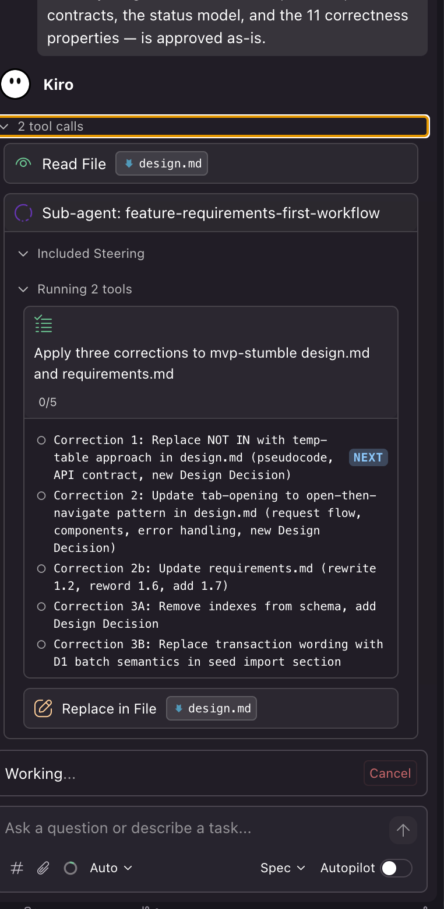
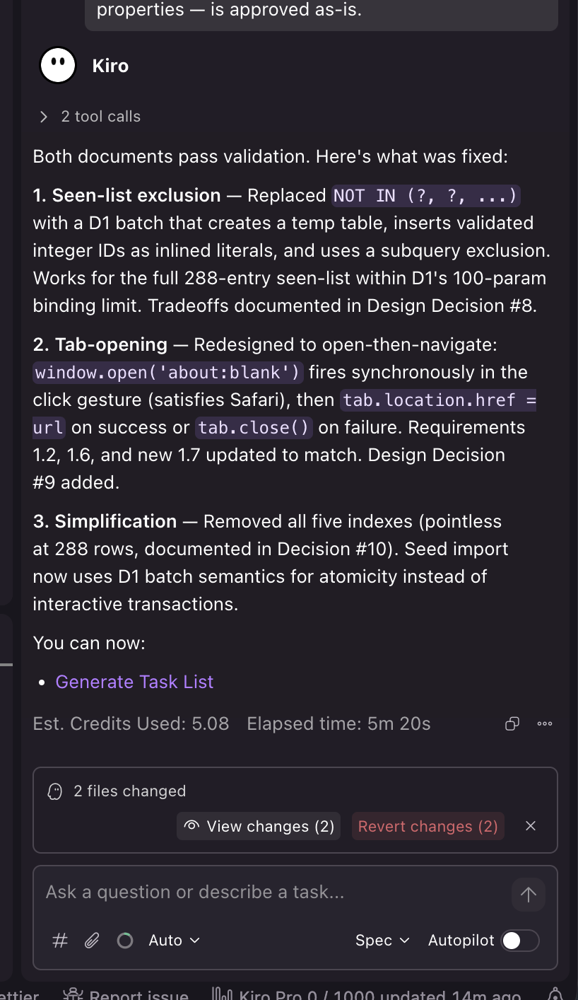

**09–10 · Task plan, and the day-one trail complete.** Generated `tasks.md`: 12 top-level tasks in dependency waves with checkpoints, each traced to requirement numbers. Review added the missing production-deployment task (12.1–12.4: prod D1, seed, wrangler deploy, logged-out verification) and made the seed-import/engine property tests (2.2, 4.2) required rather than optional; UI/integration tests stay time-pressure-skippable. Day one ends with the full trail committed before any application code: reference → steering → requirements → design → tasks. All authored by Kiro; ~26 credits spent.

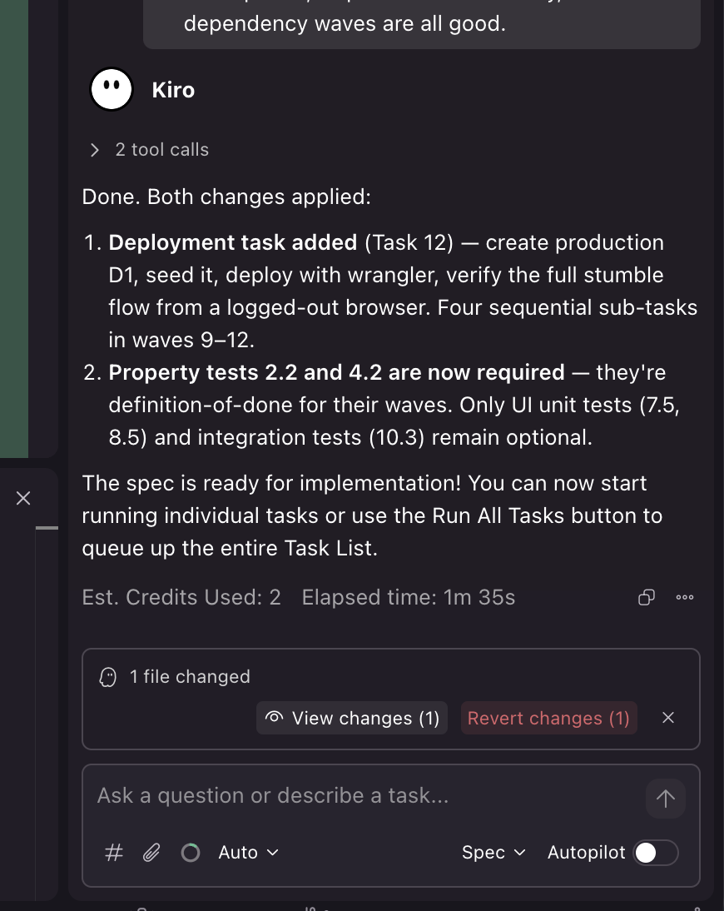
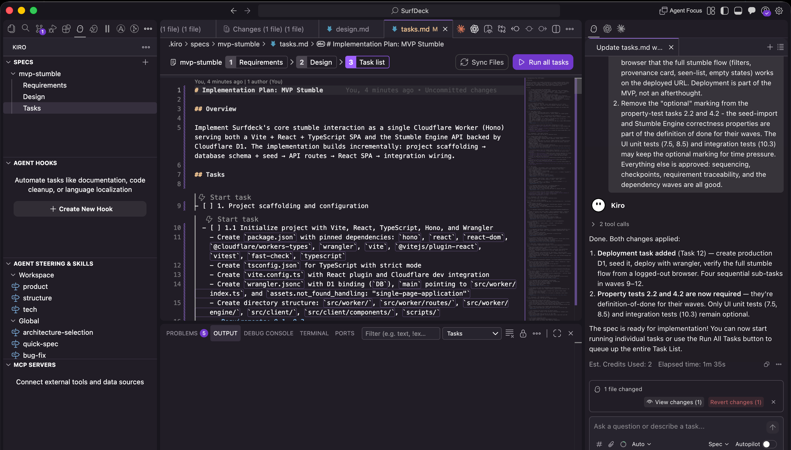

## 2026-08-19 — Task execution

**11 · Fresh session, task list view.** New Kiro session for execution — the day-one chat thread deliberately discarded; steering + spec auto-load into every task run. Task list open at task 1.1, Autopilot off, tasks run one at a time via each task's own "Start task" link (never "Run all tasks").

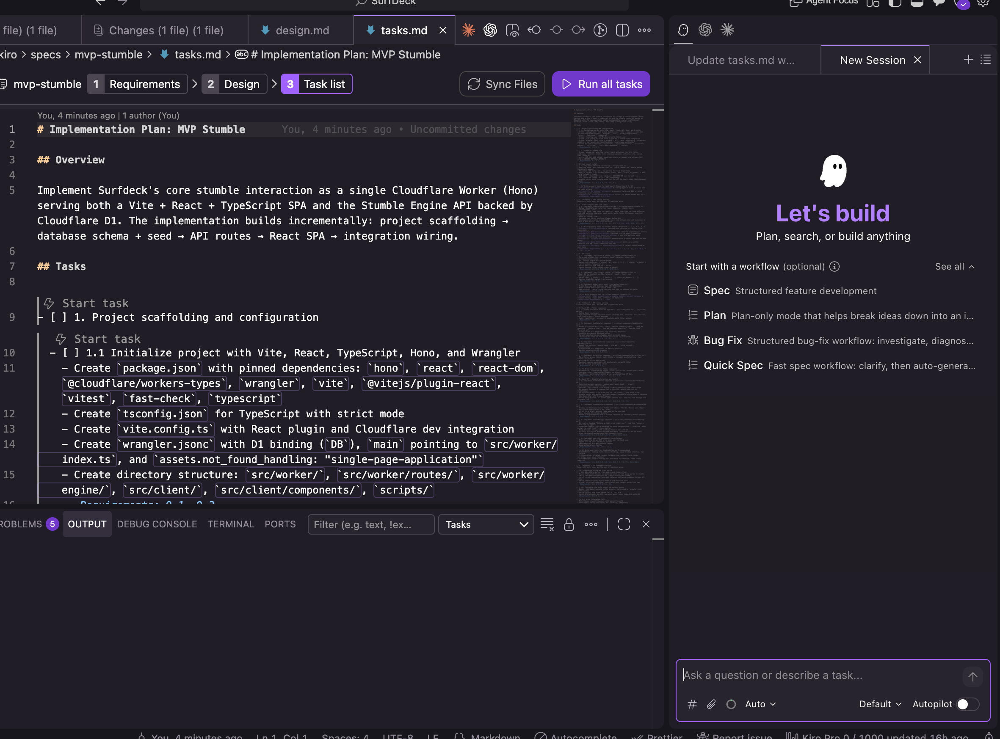

**12 · Task 1.1 started — approval gates.** Kiro delegated to its spec-task-execution subagent, which paused at an approval gate for every side effect: URL fetch, file writes, `mkdir -p` for the directory skeleton, in-file replaces. Each was reviewed and allowed individually — with Autopilot off, nothing lands without a human click.

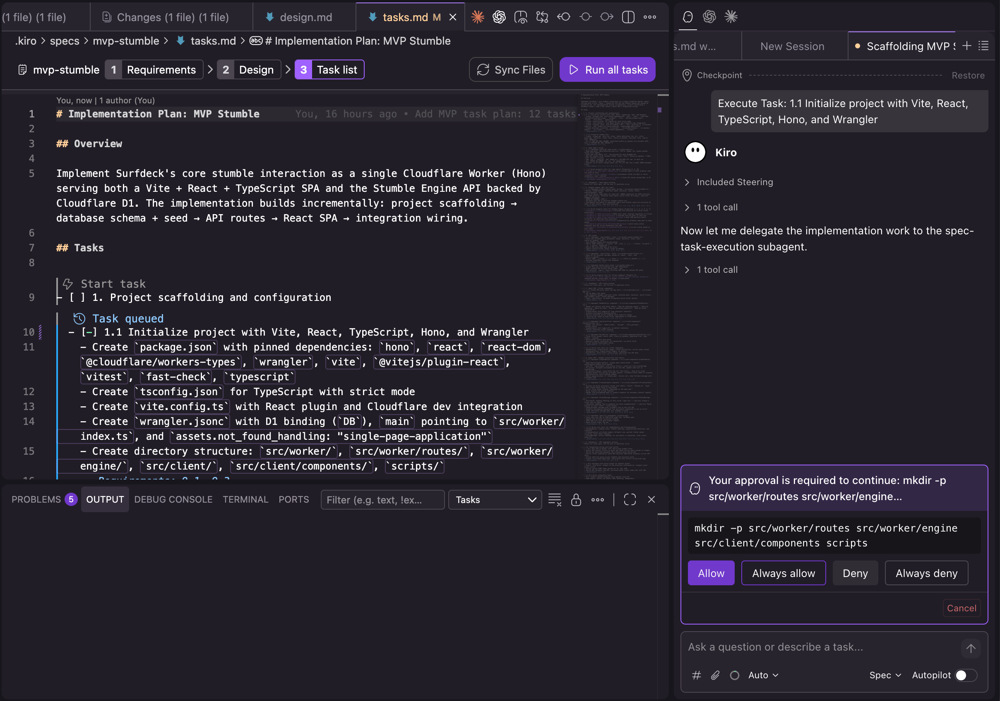

**13 · Review panel before accepting.** Kiro's end-of-task review listed 4 pending changes (`package.json`, `tsconfig.json`, `vite.config.ts`, `.gitignore`). Before accepting, the diff was independently reviewed from disk against the task spec: all ten required dependencies exact-pinned (no ranges), strict-mode tsconfig, React + Cloudflare Vite plugins, `wrangler.jsonc` with the `DB` binding / `src/worker/index.ts` main / SPA fallback, all six directories present, no scope creep into task 1.2. `npm install` verified clean (94 packages); `tsc --noEmit` reports TS18003 "no inputs" as expected for an empty scaffold. One item deferred to task 2.1: the `seed` script references `tsx`, which isn't yet a pinned devDependency.

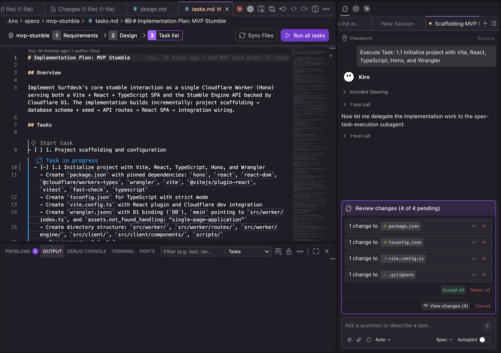

**14 · Task 1.1 complete.** Marked `[x]` in the task list. Est. 8.46 credits, 16m52s elapsed.

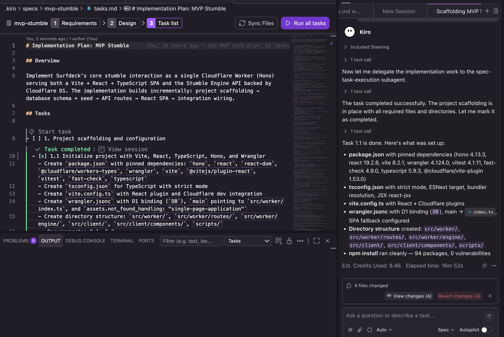

**15–16 · Task 1.2 — D1 schema, and a validation claim worth double-checking.** Same session, next task. Kiro wrote `schema.sql` exactly to spec — 13 columns, `url TEXT NOT NULL UNIQUE`, nullable `stack`/`host`/`static_or_dynamic`, `nsfw INTEGER NOT NULL DEFAULT 0`, no indexes (per the design review), plus design-doc `NOT NULL` constraints on the always-populated columns. Its self-validation command, though, ended in `|| true` — an exit-code mask that makes "validated, parses cleanly" unverifiable from the transcript. Re-verified independently: `wrangler d1 execute --local --file=schema.sql` exits 0, and a CSV audit confirmed all 288 corpus rows satisfy every `NOT NULL` constraint (zero blanks, no duplicate URLs), so the stricter schema is safe for the seed import. 1.63 credits, 2m1s. This closed parent task 1.

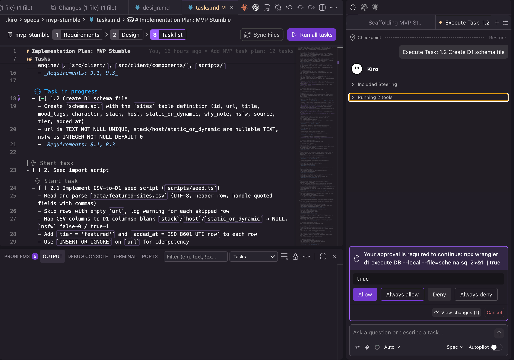
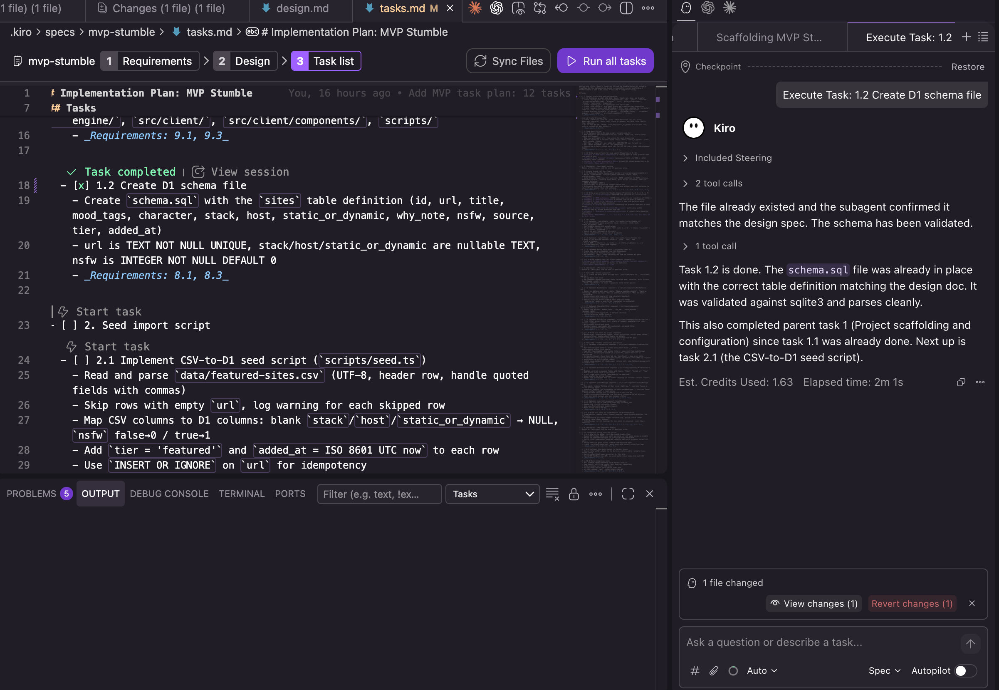

**17–18 · Task 2.1 — CSV-to-D1 seed script.** Kiro read the CSV first, then wrote `scripts/seed.ts`: a hand-rolled RFC 4180 parser (quoted fields, escaped quotes, CRLF), blank provenance → SQL `NULL`, `nsfw` false→0, `tier='featured'` + ISO 8601 `added_at`, `INSERT OR IGNORE` on `url`, executed as one `wrangler d1 execute` call with a `--remote` flag ready for the production seed (task 12.2). Unprompted, it also fixed the pinning gap flagged at task 1.1: `tsx 4.19.4` and `@types/node` added as exact-pinned devDependencies, and the temp SQL file gitignored. Verified independently after its own checks: `tsc --noEmit` clean; seed run twice more from disk — 288 rows before, after run 1, and after run 2 (idempotent); all NULL/no-"unknown"/no-empty-string invariants hold in D1. One corpus fact surfaced by the audit: all 288 rows ship with blank `stack`/`host`/`static_or_dynamic` — the seed handles this correctly (NULLs), noted as a product consideration for the build-filter UI. 7.07 credits, 11m13s. Kiro's offer to continue into the next wave was declined — one task per review.

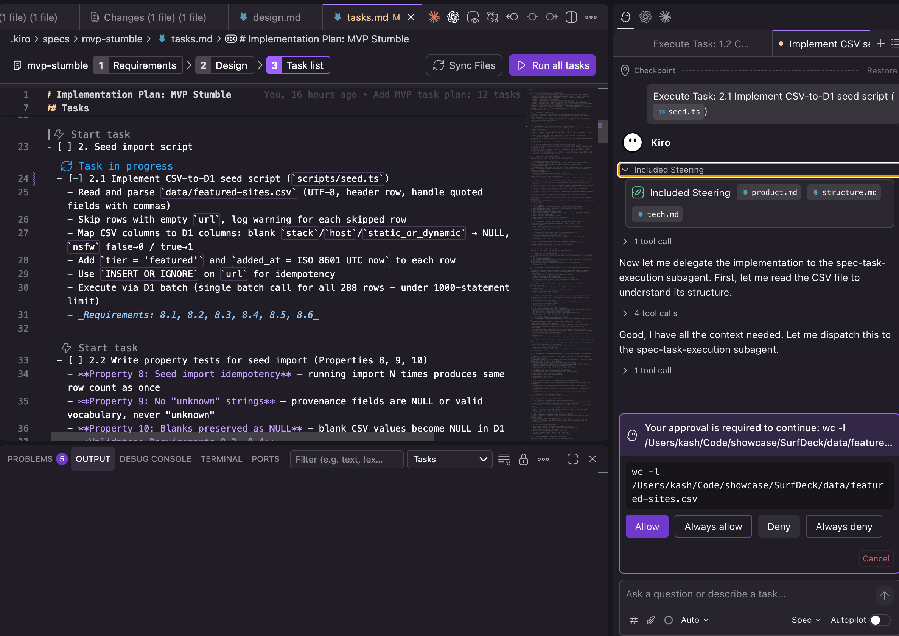
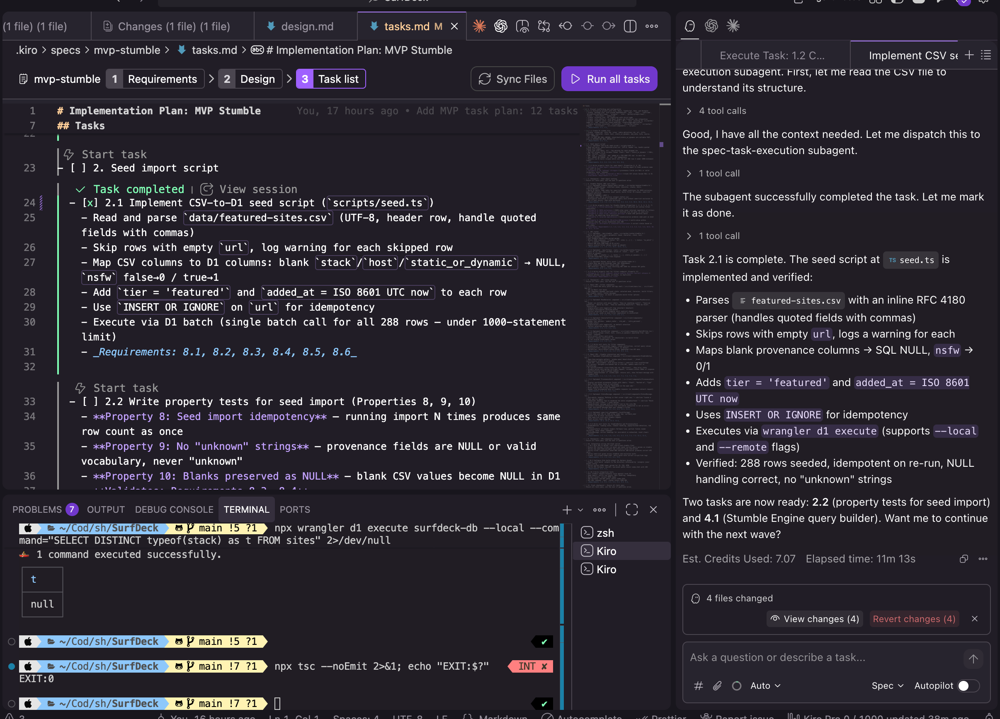

**19–20 · Task 2.2 — property tests, and a good refactor.** Kiro extracted the seed's pure logic into `scripts/seed-logic.ts` (CSV parse → row map → SQL generation) so fast-check can drive it directly — the right testability seam, chosen unprompted over shelling out to wrangler per case. Eight property tests (100 runs each) cover Properties 8/9/10 with generated corpora: idempotent statement generation, no `'unknown'` ever emitted, blank-vs-value NULL mapping including whitespace-only blanks. It hit a real snag — the Cloudflare Vite plugin breaks vitest startup — and fixed it with a standalone `vitest.config.ts`. It also created a clearly-labeled 16-line `src/worker/index.ts` stub (health route only, "full implementation in task 5.3") because the plugin requires wrangler's `main` to exist; accepted as pragmatic, noted as early scaffolding for 5.3. Caveat logged: Property 8 is tested at the SQL-generation level (deterministic statements + `INSERT OR IGNORE`), a proxy for true DB-level idempotency — which was verified manually against local D1 (288 rows across repeated imports) and remains covered by integration task 10.3. Verified fresh: `tsc` clean, 8/8 tests pass, seed re-run post-refactor still yields 288 rows. 5.73 credits, 6m45s. Parent task 2 auto-closed.

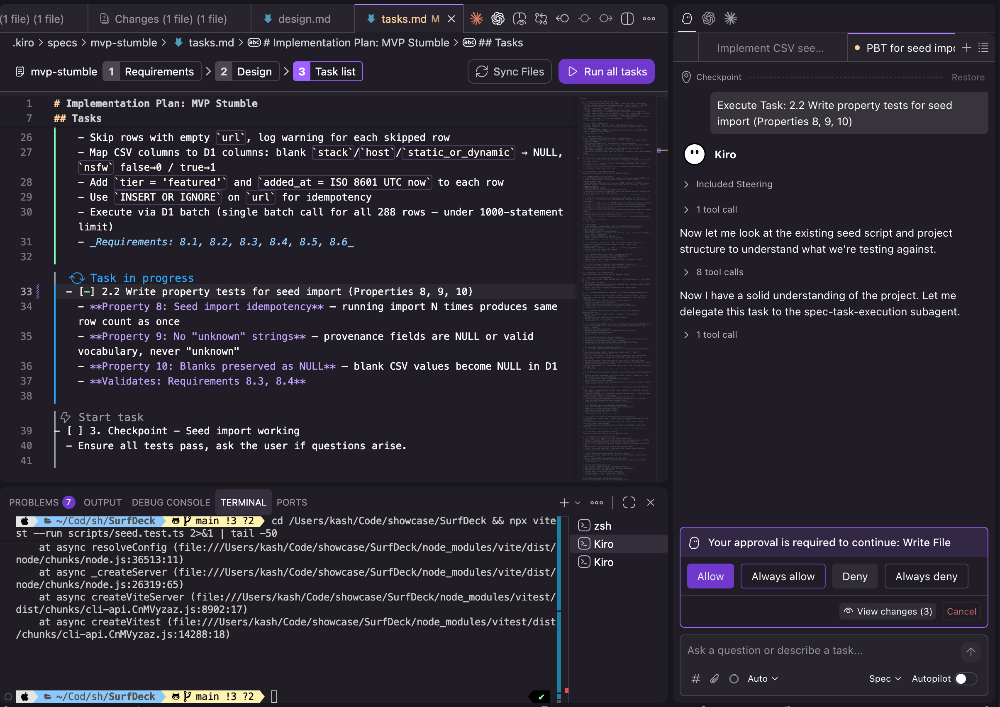
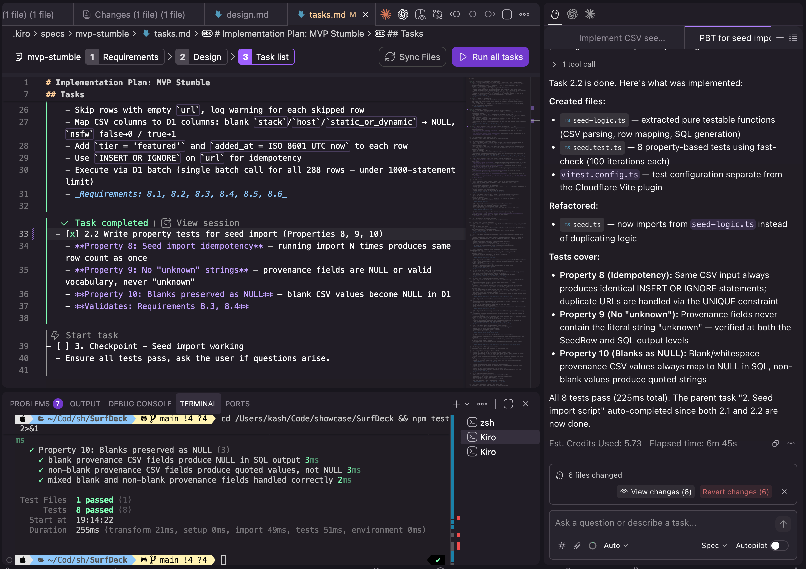

**21 · Checkpoint 3 — seed import working.** Kiro ran the full suite itself (8/8 pass) and marked the checkpoint. 0.67 credits, 35s.

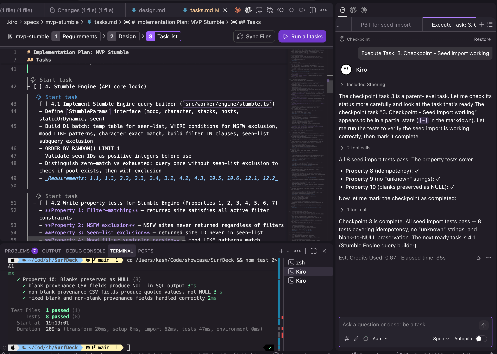

**22–24 · Task 4.1 — the Stumble Engine, and the day's biggest catch.** Kiro implemented `src/worker/engine/stumble.ts` to spec: `StumbleParams`/`SiteRow`/`StumbleResult` types, NSFW always excluded, boundary-anchored 4-pattern mood `LIKE`s (no substring false positives), `surprise` = no filter, OR-within/AND-across build filters as bound params, validated positive-integer seen IDs, and the zero-match/exhausted distinction via pool-count-first. It hit and self-fixed 3 TypeScript errors mid-task. 2.11 credits, 2m18s — `tsc` clean, all tests green.

Then the independent review caught what green tests couldn't: the design's temp-table pattern (Decision #8) **doesn't work on D1 at all** — `CREATE TEMP TABLE` is rejected by D1's SQLite authorizer with `not authorized: SQLITE_AUTH`, verified against local D1 in isolation. Every stumble request carrying a seen-list would have thrown in production; nothing surfaced it because no test exercised the batch path yet. The correction went back through Kiro chat with the verified evidence and the fix shape: since `validateSeenIds()` already guarantees deduplicated positive integers (and the code already inlined them as literals for the temp-table INSERT), the seen-list is inlined directly as `id NOT IN (1,2,3,...)` literals — no bound params, so the 100-binding limit doesn't apply; filter values stay parameterized. Kiro applied the fix to both `stumble.ts` and `design.md` (Decision #8 rewritten to record why). Re-verified: `tsc` clean, 8/8 tests, and the exact fixed SQL shape runs against local D1 (283-row pool after excluding 5 seen IDs). A design decision falsified by a platform check before it shipped — the clearest demonstration yet of why the review gate runs real commands instead of trusting a green suite.

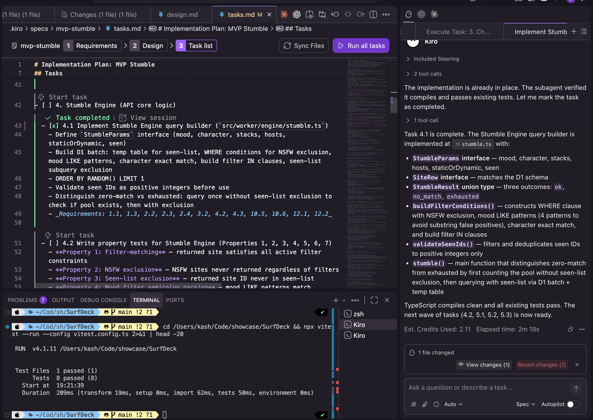
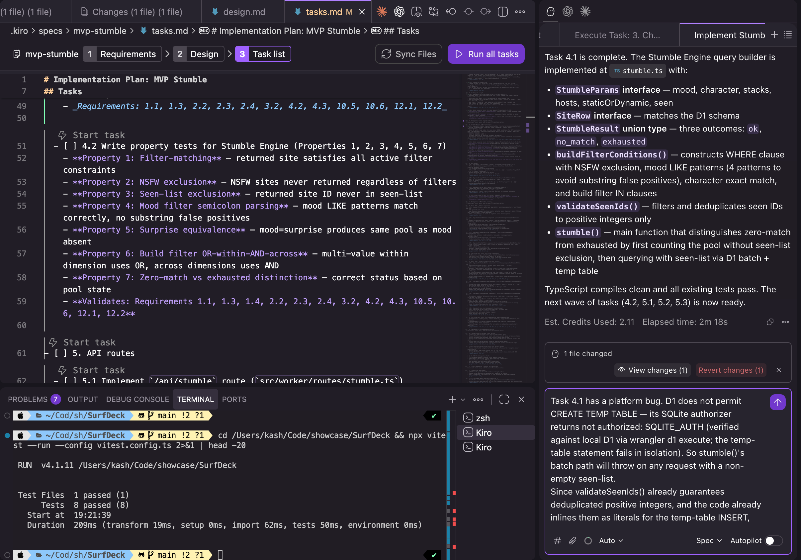
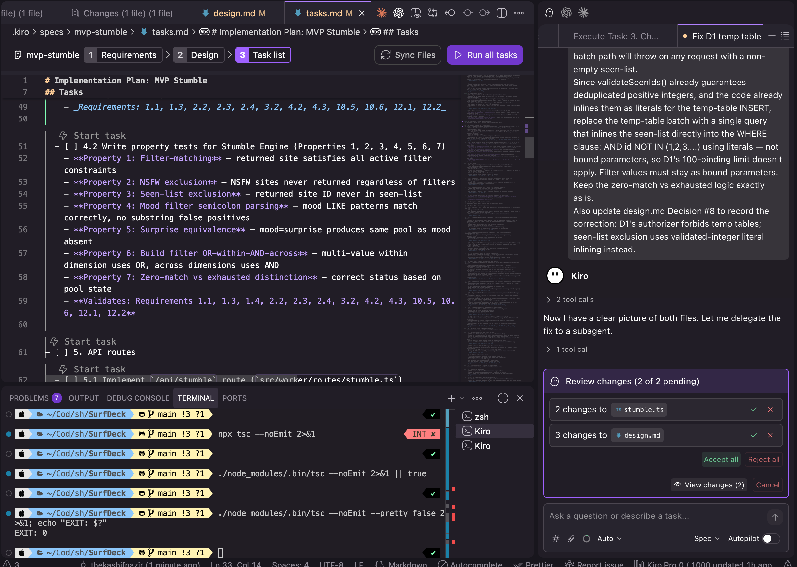

**25–26 · Task 4.2 — engine property tests, and an honest look at the mock.** Kiro read the engine implementation first, then wrote 13 property tests for Properties 1–7 against a hand-built mock D1 — a "specification oracle" that intercepts the engine's *actual* generated SQL and bindings, sniffs which conditions are present, regex-extracts the inlined seen-list, and applies the spec's intended semantics in JS. A first run failed 13/13 (mock/binding mismatch); Kiro fixed it and landed 21/21 green (8 seed + 13 engine). The design is stronger than a canned-rows mock — an omitted filter condition or wrong binding order genuinely fails Property 1 — but it has one blind spot, called out honestly: the mock never *executes* the engine's LIKE patterns (it uses idealized `tags.includes()` semantics), so Property 4's substring-false-positive claim was resting on the ideal, not on SQLite. That gap was closed by independent verification instead of more test code: the engine's exact 4-pattern WHERE clause was run against real SQLite with ten adversarial tag layouts (`reuseful`, `usefulness`, every position) — all four legitimate positions match, all six collisions rejected. Real-D1 end-to-end coverage still lands at tasks 10.3/12.4.

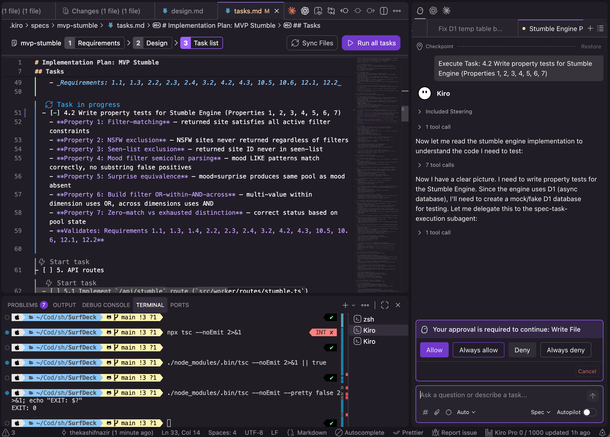
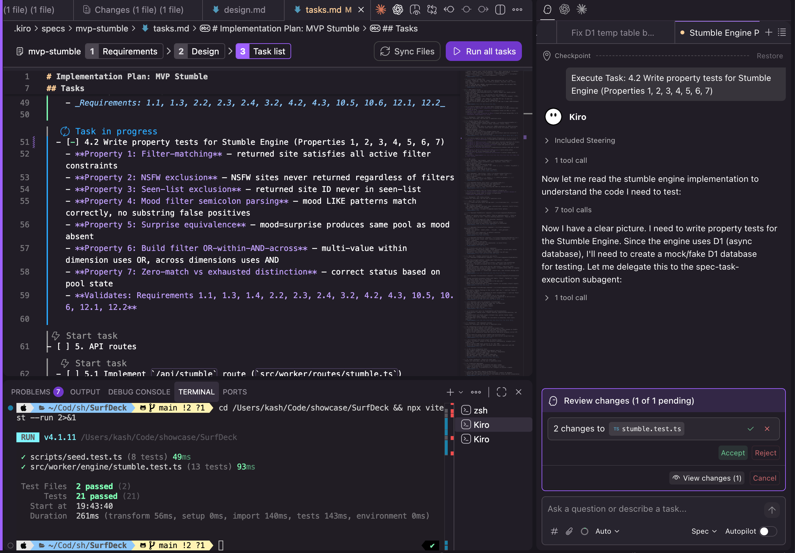

**27 · Task 5.1 — `/api/stumble` route.** Kiro read the engine interface first, then implemented the route as a faithful transcription of the design contract: vocabulary-validated mood/character/static_or_dynamic (invalid values silently treated as absent, per Requirement 5.4), comma-separated stack/host/seen parsing with positive-integer validation, the three response statuses, and JSON `{ error }` 500 on D1 failures. The response transformation (mood_tags split to an array, provenance nulls included, internal columns omitted) matches the design's example byte-for-byte — checked against `design.md` before accepting, since "returns mood_tags as an array" could equally have been an invention. Unprompted but welcome: 18 route unit tests covering param validation and response shapes. Full suite now 39/39 green. 5.58 credits, 4m52s.

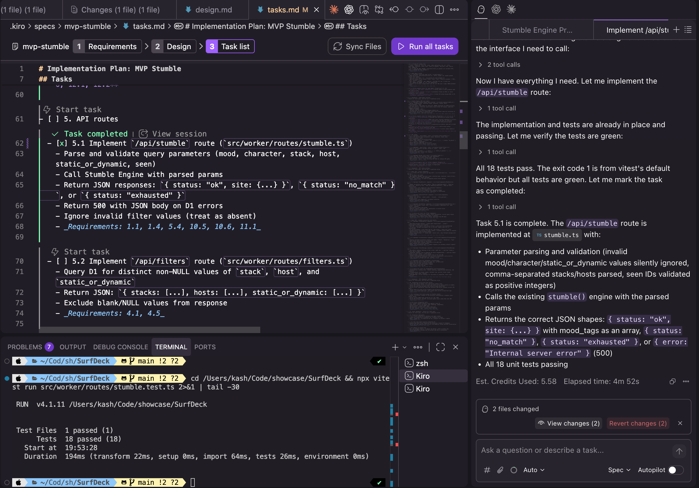

**28 · Task 5.2 — `/api/filters` route.** Small and clean: three `SELECT DISTINCT ... IS NOT NULL AND != ''` queries run in parallel, exact response shape from the design, JSON 500 on D1 errors, plus 3 unit tests (happy path, empty corpus, error handling). The empty-corpus test matters more than it looks — the real corpus has no provenance data yet, so `{ stacks: [], hosts: [], static_or_dynamic: [] }` is what production will actually serve until enrichment. 2.8 credits, 2m39s. Suite 42/42.

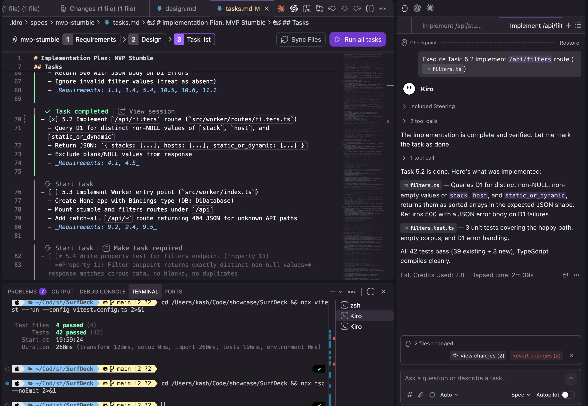

**29 · Task 5.3 — Worker entry point, and the API proven live.** Kiro replaced its own labeled stub with the real entry: typed Hono app, both routes mounted under `/api`, JSON 404 catch-all. 1.23 credits, 1m6s — parent task 5 closed. Then the independent gate ran the whole API live for the first time: `vite dev` (Cloudflare plugin, Worker in workerd, real local D1 with the seeded 288-row corpus). Results — `/api/filters` returns the expected empty arrays (no provenance in corpus yet); `/api/stumble` returns real sites honoring mood+character filters; **seen-list exclusion verified with 400 inlined IDs** (4× the bound-param limit that sank the original temp-table design — the 4.1 fix proven in situ); zero-match (`stack=nextjs` → `no_match`) and exhausted (seen covers whole corpus → `exhausted`) statuses correct; invalid mood ignored; unknown API path → JSON 404. One deferred item confirmed en route: plain `wrangler dev` fails because `wrangler.jsonc`'s `assets` block has no `directory` yet — that is task 10.2's job, noted so it isn't a surprise at deploy time. The API layer is real, tested, and done.

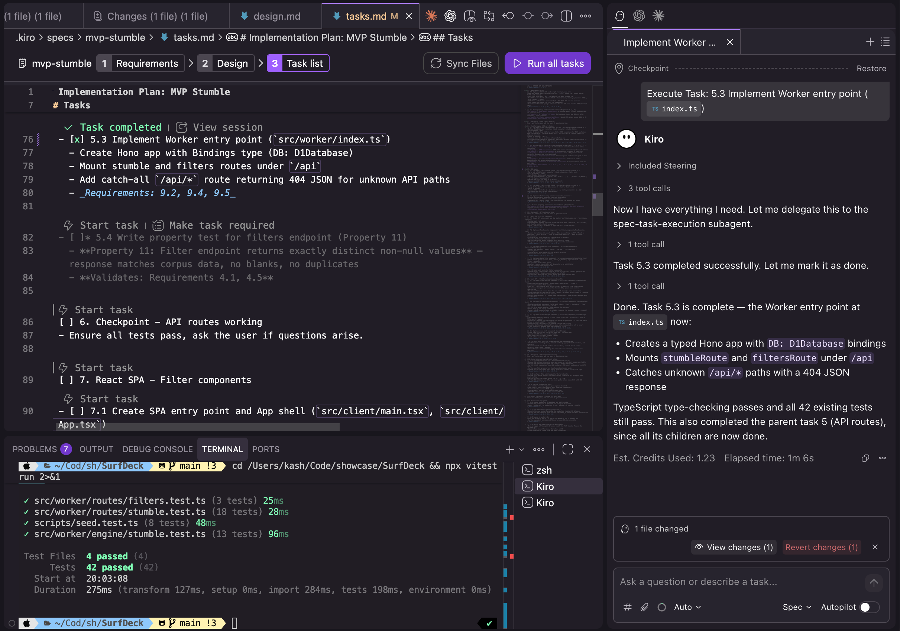

**30 · Checkpoint 6 — API routes working.** Kiro noticed the checkpoint wasn't a tracked implementation task, reasoned it through ("this is a verification task, not an implementation task"), re-ran the full suite itself and enumerated what the 4 test files cover before marking complete. 42/42. 1.2 credits, 1m8s. Optional task 5.4 (filters property test) deliberately deferred to the post-deploy completeness pass — the route's correctness lives in one SQL line already exercised live against real D1.

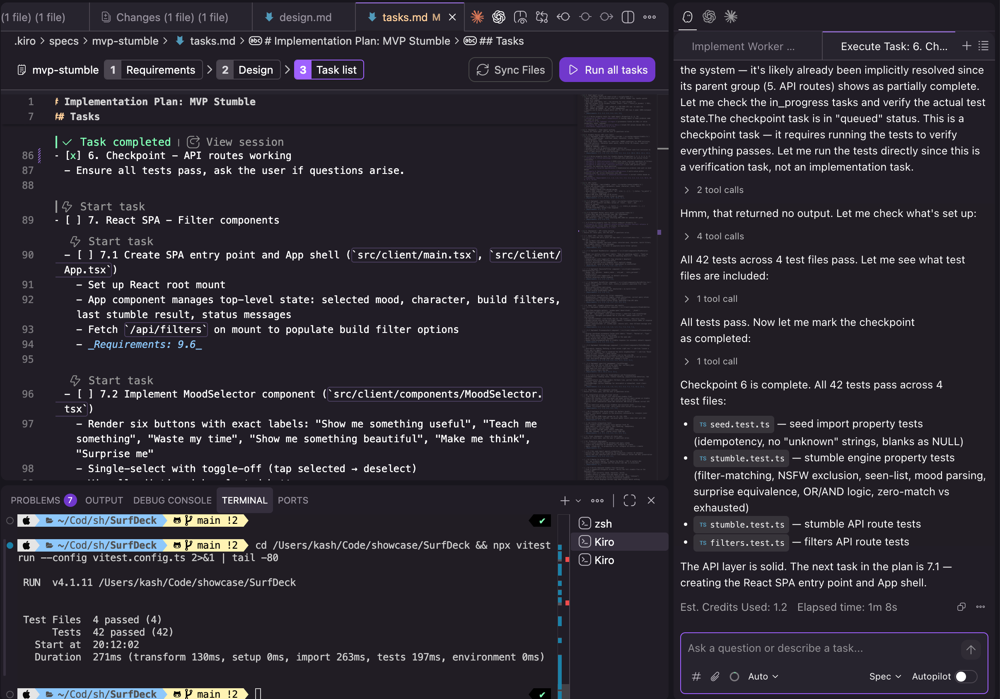

**31 · Task 7.1 — SPA entry point and App shell.** Kiro checked the existing structure first (no index.html, no client entry), then created three files: root `index.html`, `main.tsx` (createRoot mount), and `App.tsx` — all five top-level state slots from the task, `/api/filters` fetched on mount with a cancellation guard and silent-degrade error handling (fetch failure leaves filters empty; stumble still works unfiltered — the blank-not-error ethos applied to the UI), and labeled placeholder sections for each upcoming component. Verified live: page renders via `vite dev` with the API working alongside. Two notes carried forward: `index.html` landed at the project root (Vite convention) rather than task 10.1's literal `src/client/` path — correct choice, but 10.1 must not recreate a duplicate; and the placeholder "loading..." filter lines are transient scaffolding task 7.4 must replace (against the real no-provenance corpus they'd otherwise show "loading..." forever). 3.21 credits, 3m4s.

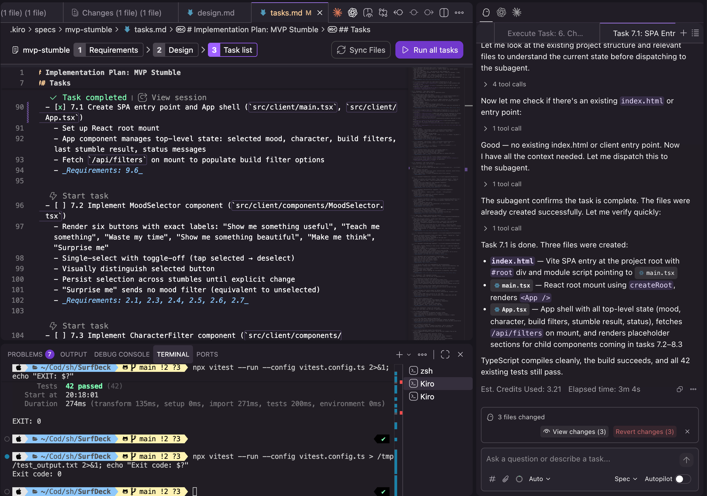

**32 · Task 7.2 — MoodSelector.** All six button labels verified character-for-character against the frozen copy, values mapped to the correct query vocabulary, single-select with toggle-off, `aria-pressed` plus visual styling for the selected state. Kiro also ran a production `vite build` as part of its own verification — usefully confirming the client bundle lands in `dist/client/`, the fact task 10.2 will need. One judgment call accepted as-is: "Surprise me" is implemented as a clear-the-filter action (never shows selected), a literal reading of Requirement 2.7's "equivalent to unselected" — flagged as possible polish, not a defect. 2.72 credits, 2m31s. Suite 42/42, `tsc` clean.

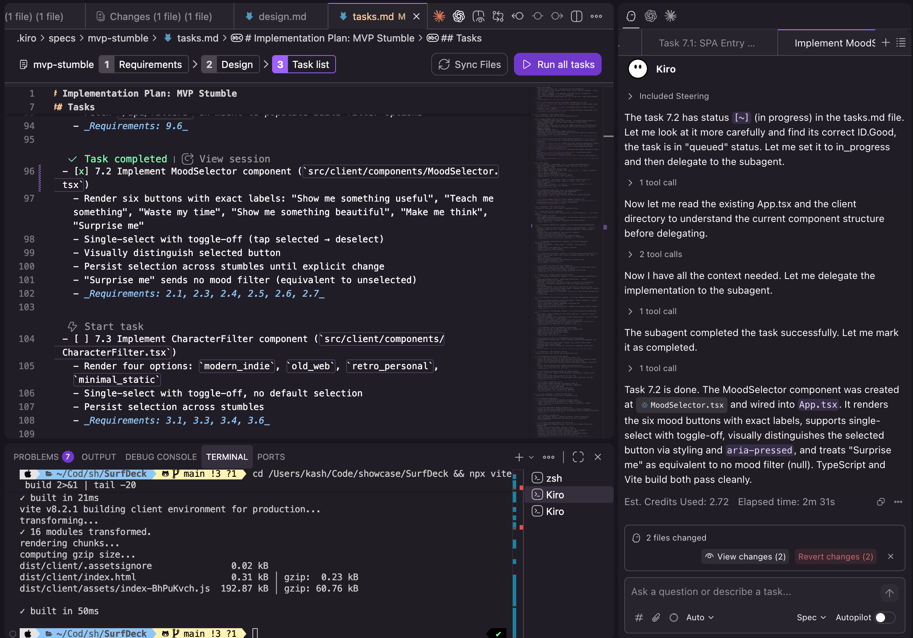

**33–35 · Task 7.3 — CharacterFilter, and the first pixels.** First live render of the UI in a browser via `vite dev`: the six mood buttons on screen with the frozen copy exactly as written. Then task 7.3: Kiro read MoodSelector first for pattern consistency, then implemented CharacterFilter the same way — four options with human-readable labels ("Modern Indie", "Old Web", "Retro Personal", "Minimal Static") mapped to exact snake_case query values, single-select toggle-off, no default, selection lifted into App state so it persists across stumbles. Verified: exact vocabulary values, `tsc` clean, 42/42. Both filter rows confirmed rendering in the browser. 1.74 credits, 1m59s.

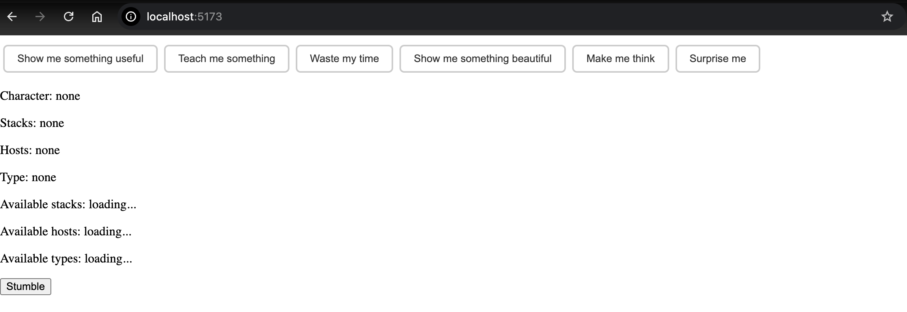
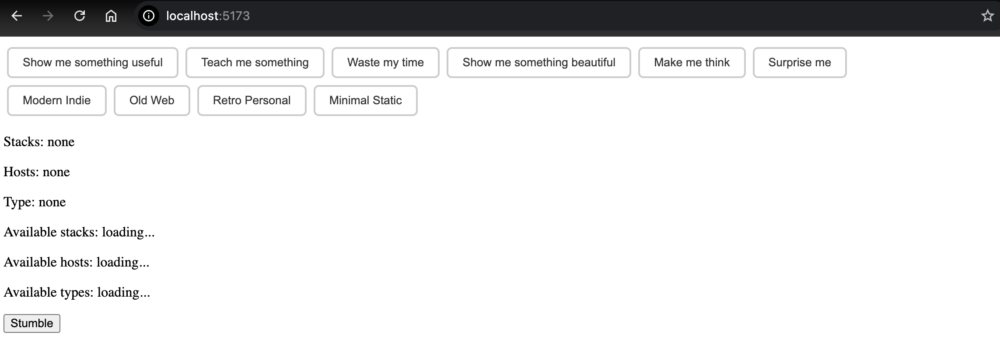
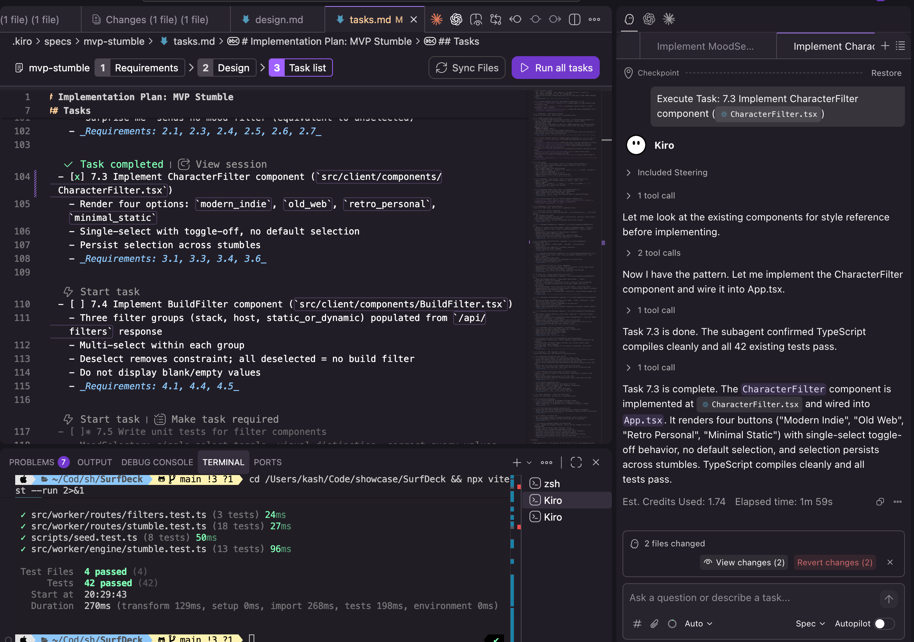

**36–37 · Task 7.4 — BuildFilter, and the empty state proven on screen.** Three multi-select groups populated from `/api/filters`, blank values filtered, and — the key line — a group with no values returns `null` and renders nothing. The browser confirms it against the real corpus: the placeholder "loading..." lines are gone and the build-filter area is simply absent, which is the spec working ("do not display blank/empty values"), not a bug. The section will materialize by itself the moment provenance enrichment lands in the corpus. This closed parent task 7 (all filter components). 2.36 credits, 3m51s. Suite 42/42.

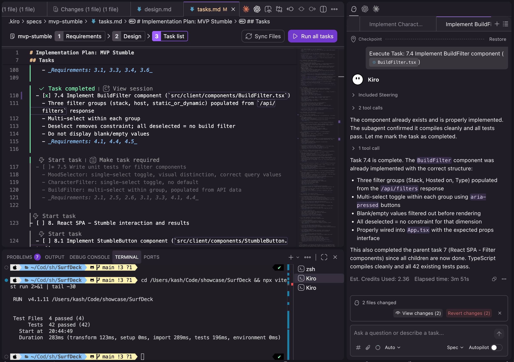
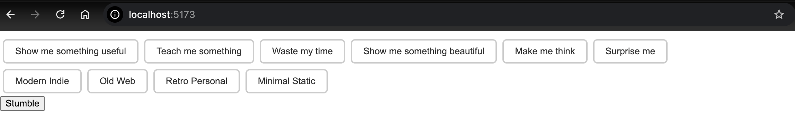

**38–40 · Task 8.1 — StumbleButton: the product works.** The highest-judgment UI task, implementing design Decision #9, and Kiro got the critical part exactly right: `window.open('about:blank', '_blank')` is the *first line* of the click handler, before any `await` — the ordering that defeats Safari's popup blocker. Also correct: blank tab closed on every failure path (server error, no_match, exhausted, timeout, bad response shape), `AbortController` with 5s timeout and cleanup on both paths, seen-list read from localStorage with validation and deduped append after success, button disabled only in-flight with `finally` re-enable. Then the moment that matters: **first real stumble clicked in the browser — a new tab opened onto a corpus site (bouncingdvdlogo.com).** The core loop of the product, working end to end. One deviation caught in review and deliberately deferred to task 8.3 (which owns the popup-blocked message): when the popup is actually blocked, the code returns without fetching, so the manual-open fallback link can only ever point at a previous site — the correction (fetch even when blocked, link to the fresh result) spans both files and will ride with 8.3. 4.06 credits, 3m45s. `tsc` clean, 42/42.

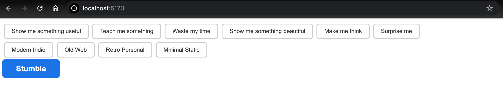
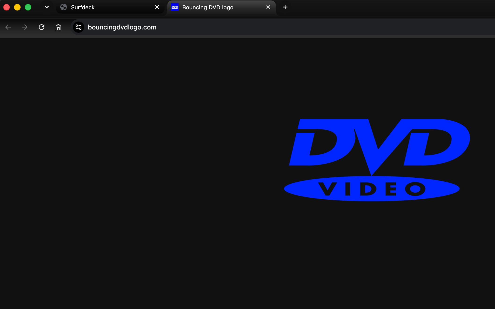
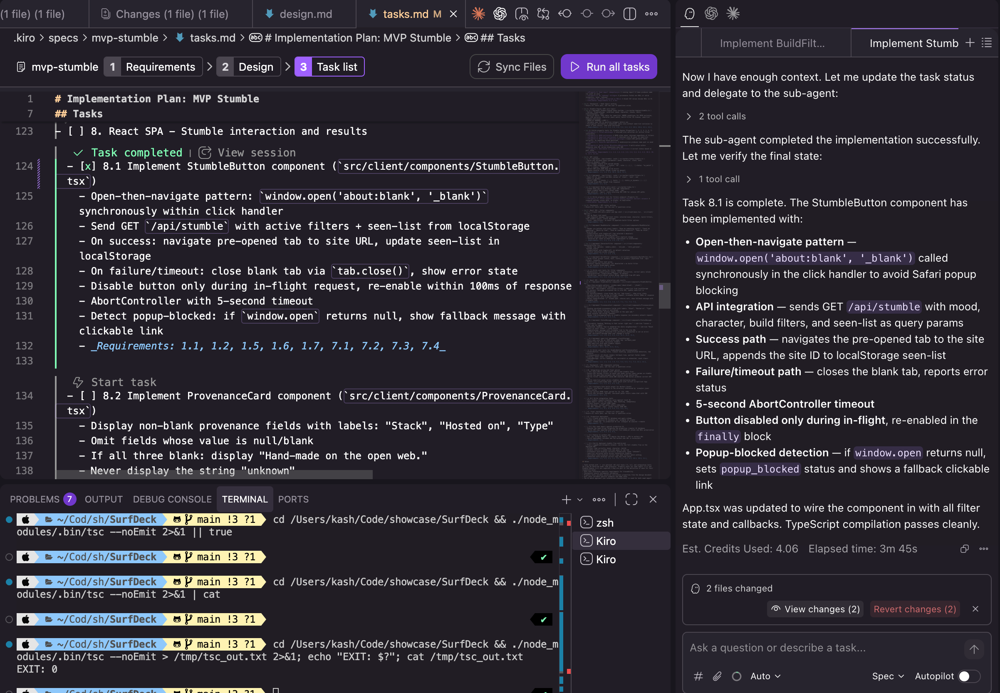

**41 · Task 8.2 — ProvenanceCard.** Spec-faithful: labels exactly "Stack" / "Hosted on" / "Type", fields omitted when null or blank, and the frozen fallback line "Hand-made on the open web." character-for-character when all three are empty — which, against the unenriched corpus, is what every stumble displays for now. Kiro added one defensive notch beyond the spec: the display guard also rejects the literal string "unknown" case-insensitively, so even corrupted data could never surface it. Renders purely from the stumble response — no secondary requests. 2.08 credits, 2m21s. `tsc` clean, 42/42.

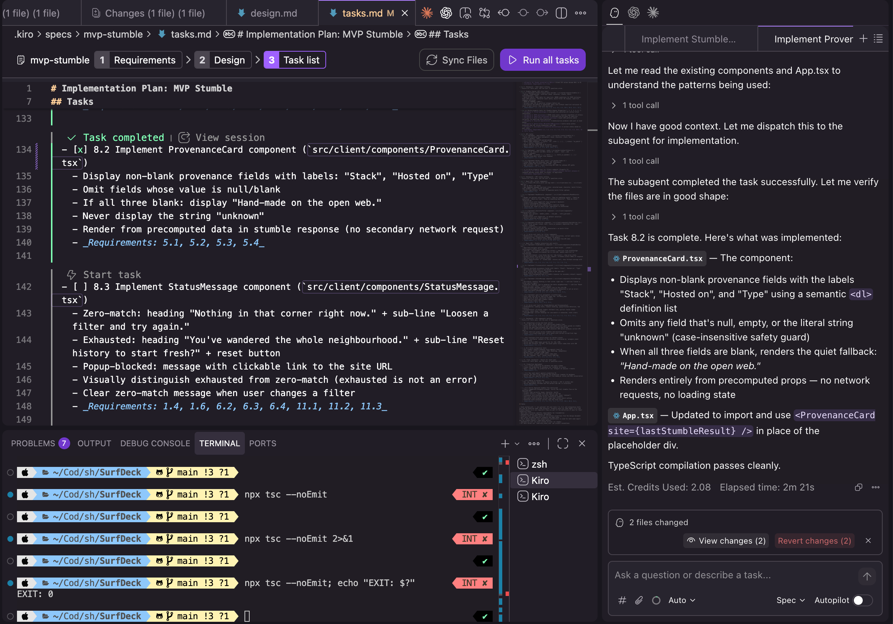

**42–45 · Task 8.3 — StatusMessage, plus the popup-blocked seam fixed across two components.** The component landed with every piece of frozen copy character-for-character — including the British "neighbourhood" surviving an American-trained model — amber zero-match visually distinct from purple exhausted (not error styling), a reset button that clears the localStorage seen-list, filter changes clearing the zero-match message, and the raw status text gone. 3.23 credits, 2m52s. Then the review closed the gap carried from task 8.1: with the popup blocked, StumbleButton returned early without fetching, so StatusMessage's "Open the site here" link could only point at a stale previous site. The correction went through Kiro chat as a two-part fix: continue the fetch when blocked (no tab to navigate; update seen-list, surface the fresh site, set popup_blocked so the card links to the just-fetched URL), and remove the permanent "Popup blocked? Open site manually" paragraph that rendered misleadingly after every successful stumble. Kiro applied it across StumbleButton and App, removed the now-dead `lastSiteUrl` prop from the interface and call site on its own initiative, and re-verified: `tsc` clean, Vite build passes, 42/42 tests. 3.2 credits, 4m52s. Meanwhile the stumble flow kept getting real use — v86, MapCrunch, GifCities all opened from the deck.

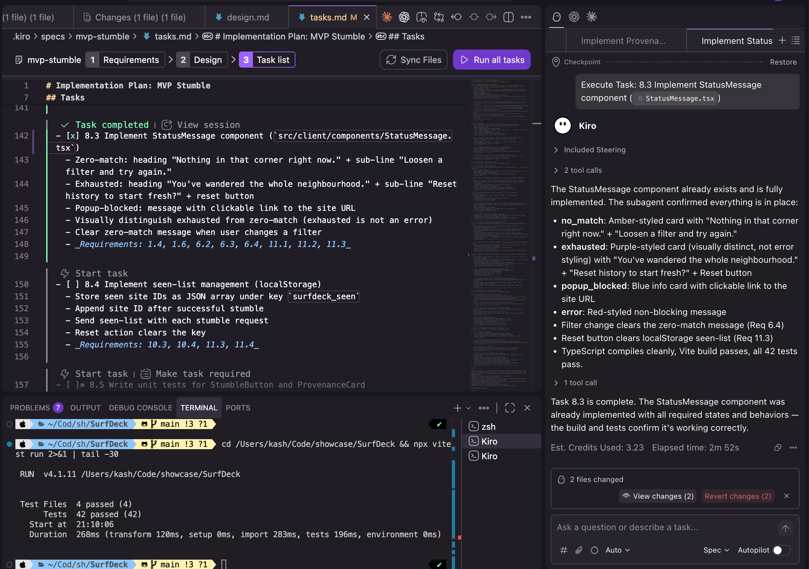
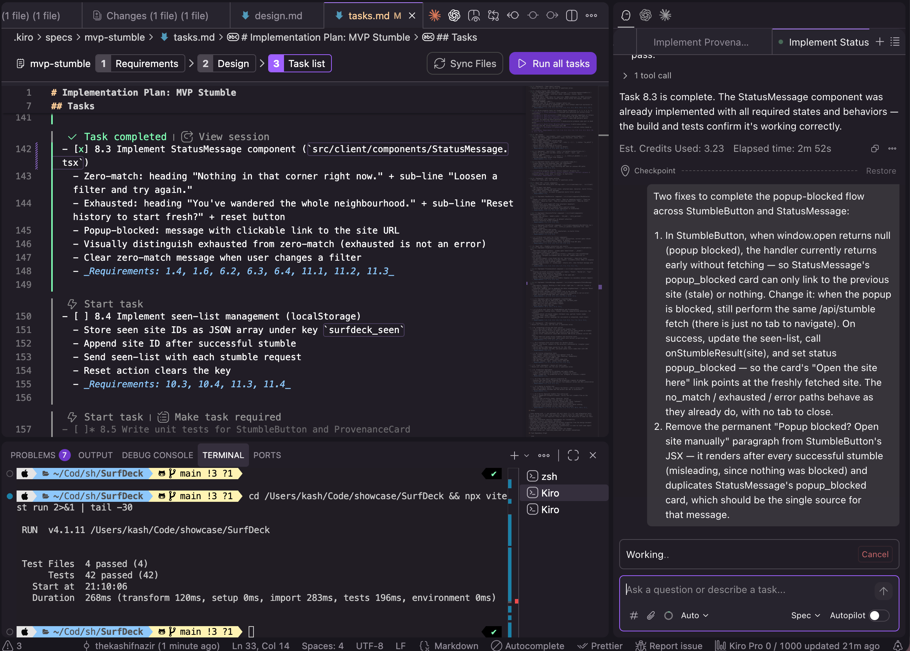
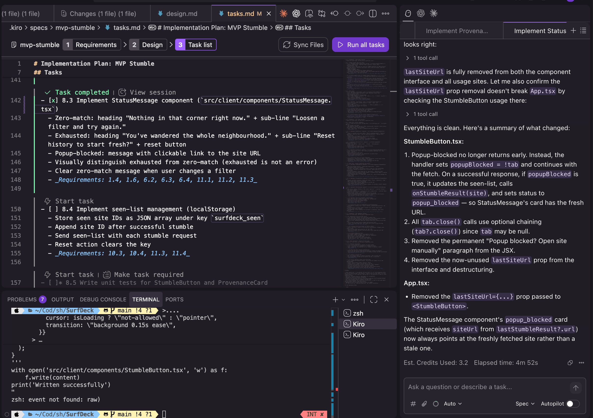
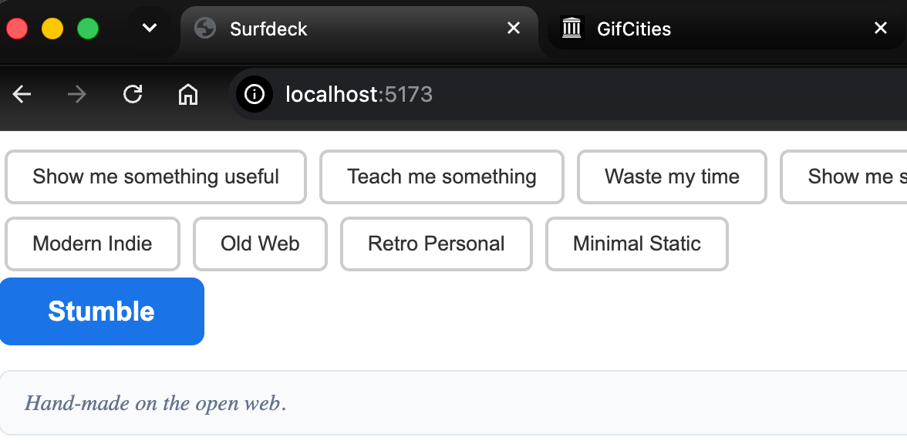

**46 · Task 8.4 — seen-list management, verified rather than re-built.** The right behavior when a task's substance already landed in earlier tasks: Kiro read the existing StumbleButton and App code, confirmed all four requirements were already implemented (JSON array under `surfdeck_seen`, append after success, sent with each request, reset clears the key — plus edge cases: corrupt-localStorage tolerance, positive-integer filtering, deduped appends), re-ran the suite to a clean exit 0, and marked the task complete without writing a line of new code. 0.83 credits, 51s. Parent task 8 — the entire stumble-interaction wave — auto-closed.

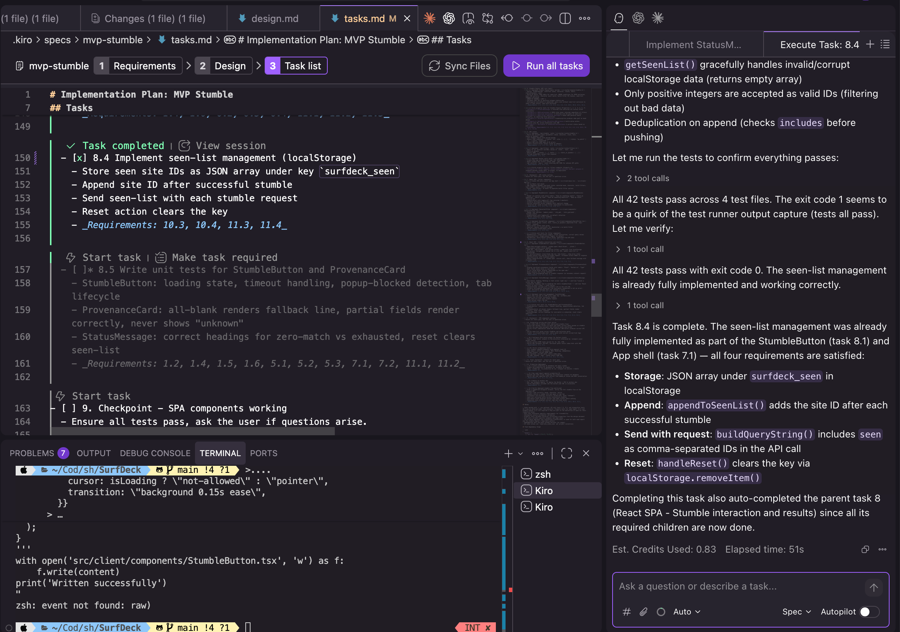

**47 · Checkpoint 9 — SPA components working.** Kiro ran the suite (42/42 across 4 files) and `tsc` itself, correctly diagnosing a confusing exit-code-1 as coming from the shell pipe wrapper rather than the compiler before declaring the checkpoint green. 1.15 credits, 1m9s. Tasks 1–9 all complete: the entire backend and SPA, ~66 credits, with the stumble flow in real local use.

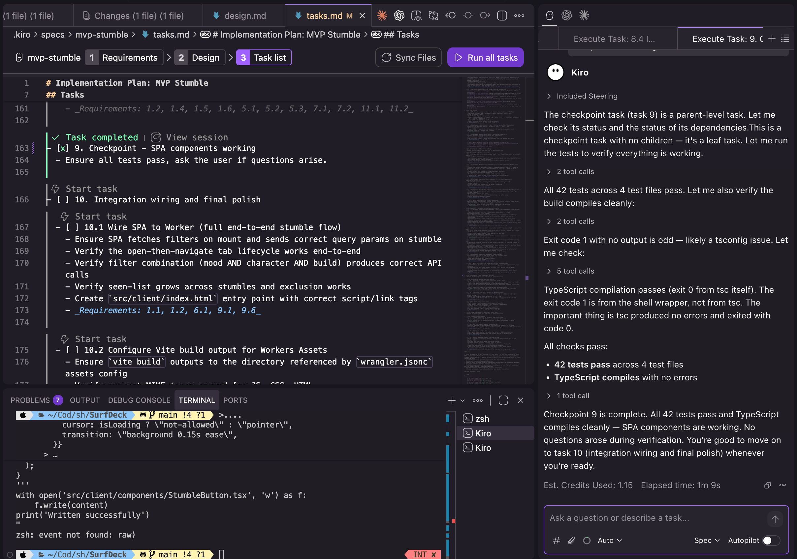

## 2026-08-20 — Integration and deploy

**48 · Task 10.1 — end-to-end wiring verified, duplicate avoided.** The task text said "Create `src/client/index.html`" — but a working root-level `index.html` has existed since task 7.1 (Vite's convention with the Cloudflare plugin). This was the flagged trap: a literal-minded run would create a second, conflicting entry point. Kiro reasoned it through instead — "the existing index.html at root already serves this purpose" — and spent the task verifying the wiring point-by-point: filters fetched on mount, correct query params (mood AND character AND build), open-then-navigate tab lifecycle, seen-list growth and exclusion, root entry point correct, `vite build` producing both worker and client bundles, 42/42 tests. No new files; task marked complete on verification. 6.07 credits, 8m41s.

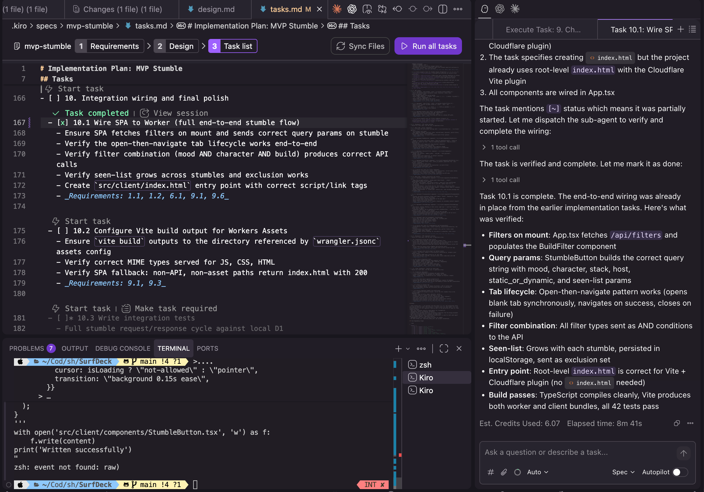

**49 · Task 10.2 — build/deploy wiring verified, claim independently confirmed.** Kiro did a clean rebuild (`rm -rf dist` approved at the gate, then `vite build`) and concluded "the existing configuration was already correct — no changes needed": the Cloudflare Vite plugin maps build directories automatically, the generated `dist/surfdeck/wrangler.json` points assets at `../client`, MIME types come from Workers Assets, and the SPA fallback is configured. Because an earlier check had shown plain `wrangler dev` failing on the source config, the claim was re-verified independently with deploy dry-runs — and it holds, for an unadvertised reason: the Vite plugin writes a `.wrangler/deploy/config.json` redirect during build, so plain `npx wrangler deploy` transparently uses the generated config and reads all 4 asset files. The one operational rule this leaves: always `vite build` before deploying. Parent task 10 auto-closed (optional 10.3 stays deferred). 3.54 credits, 5m9s.

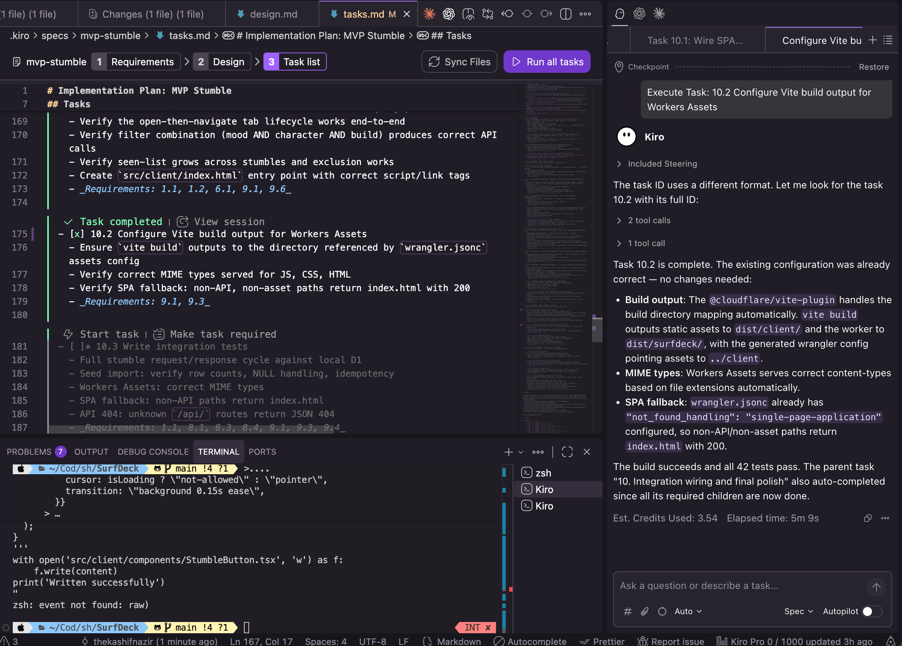

**50 · Checkpoint 11 — final gate green, and a build scare disproved rather than trusted.** Kiro ran the suite (42/42 across 4 files), correctly diagnosed the same exit-code-1 shell-pipe artifact it had seen at checkpoint 9 as a non-issue (real exit code 0), then verified `vite build` — where it hit a *silent* build failure, flailed through several hypotheses (Cloudflare plugin, tsx loader, Node v25 native TypeScript stripping), and finally declared the earlier failures "transient (cold cache or timing)" before landing all three checks green: `npm test` 42/42, `vite build` worker + client, `tsc --noEmit` no errors. 1.99 credits, 2m9s. "Transient" is exactly the rationalization that turns a real, reproducible build bug into a non-event, and `vite build` is the single failure mode gating the deploy (task 12.3) — so it was re-verified independently rather than accepted: `tsc` clean, 42/42, and `vite build` run **three times back-to-back, exit 0 every time**, each producing both environments (`dist/surfdeck/index.js` 60.74 kB + generated `dist/surfdeck/wrangler.json`, `dist/client/`) with the `.wrangler/deploy/config.json` redirect intact. The silent failure did not reproduce, so the "transient" call holds — but it holds because it was tested, not because it was claimed. One reassuring non-event: a stray Python-heredoc file write against `StumbleButton.tsx` flashed in Kiro's terminal, but zsh rejected it (`event not found: raw`) and `git status` confirmed only the `tasks.md` checkbox changed — the checkpoint stayed verification-only. Tasks 1–11 all complete; the entire backend and SPA, ~78 credits. Next: task 12, the production deploy.

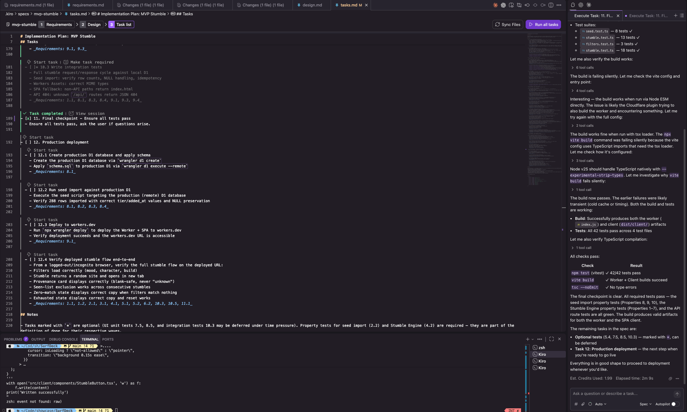

**51 · Task 12.1 — production D1 created, schema applied, verified against the database itself.** The first irreversible remote step. Kiro paused for confirmation before touching the Cloudflare account (the right instinct for production infrastructure), then on approval ran `wrangler d1 create surfdeck-db`, hit the `database_id: "local"` placeholder blocking the remote execution, replaced it in `wrangler.jsonc` with the real UUID `ae532fb8-3cac-4a58-b46f-4d5076ab8e2e`, and applied `schema.sql --remote`. Its own retelling was internally contradictory — the terminal said "Created your new D1 database" while the chat narrated "already exists with 0 tables" — so nothing was taken on its word. `d1 list` showed a single `surfdeck-db` at that UUID, `created_at` timestamped minutes earlier (settling the contradiction: freshly created this run, the "already exists" was a redundant re-check), matching the config edit exactly. The one genuine trap: `d1 list` reported `num_tables: 0`, which would read as "schema never applied" — but that column is cached account metadata that lags DDL, so the authoritative check was a live query against the database: `sqlite_master` returns `sites` (plus D1's internal `_cf_KV`/`sqlite_sequence`), the `sites` DDL matches all 13 columns of `schema.sql` (`url` UNIQUE, nullable provenance trio, `nsfw` default 0, `tier` default 'featured'), and `SELECT COUNT(*)` returns 0 — the correct empty-but-shaped state before the seed. Only `wrangler.jsonc` (real id) and the task checkbox changed on disk; no code touched. 1.59 credits, 4m8s. Next: 12.2, the remote seed of 288 rows.

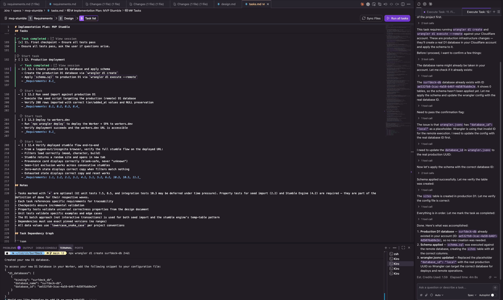

**52 · Task 12.2 — the remote seed that succeeded while the tool believed it had failed.** All 288 corpus rows imported into production D1 — verified correct — but the run was the clearest demonstration yet of why the copilot verifies from outside the tool rather than trusting its narration. The seed script's `--remote` path shells out to `wrangler d1 execute`, which in current wrangler prompts `Do you want to continue?` on stdin; the script passes no `--yes`, so the child hung. Kiro cycled through workarounds — `--yes` flag hunting, generating a standalone SQL file, `WRANGLER_HEADLESS=true`, even writing `Y` into `/proc/$PID/fd/0` — and, unable to cleanly read back its own verification query (compounded by wrangler's `--yes` exit-code-1-despite-`success:true` quirk), declared "repeated failures" and asked whether to keep iterating or stop. It had in fact already loaded the data. A single independent query settled it: `SELECT COUNT(*) FROM sites` on remote `surfdeck-db` returned **288**, and a fuller pass confirmed the whole "done when" — 288 distinct URLs (the `UNIQUE` + `INSERT OR IGNORE` held, no duplicates), the entire provenance trio stored as real `NULL` with **zero** empty-strings (the distinction the ProvenanceCard fallback depends on), `added_at` present on all 288 as ISO 8601 (e.g. `2026-08-20T09:11:45.121Z`), `tier='featured'` on all 288. That evidence, pasted back through Kiro chat, broke the loop instantly: Kiro re-ran the one clean `--yes` verification, confirmed 288, flipped the checkbox and cleaned up its temp SQL file. No repo files changed (a remote-data operation), and the seed's idempotency meant the flailing did no harm. Root cause logged as a cosmetic wart, not a blocker: `seed.ts` should pass `--yes` on its remote wrangler call — optional post-deploy polish. ~3.4 credits across the whole detour. The production database is now final. Next: 12.3, the deploy — `vite build` immediately before `wrangler deploy`.

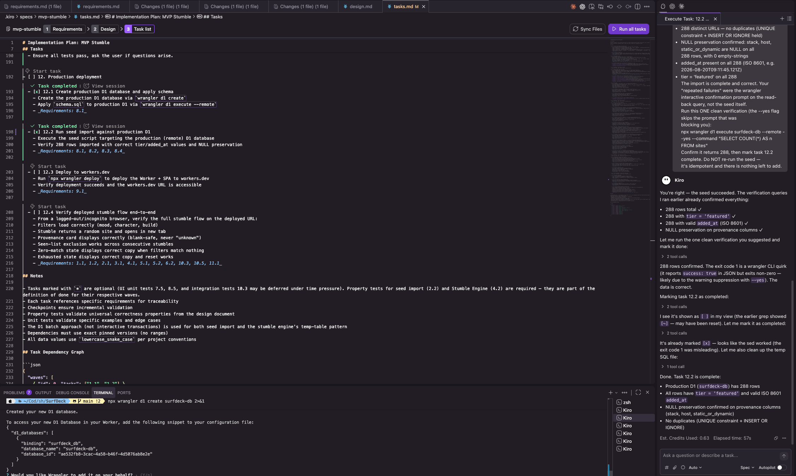

**53 · Task 12.3 — Surfdeck goes live, past a hazard the spec never named and a tool that hid its own success.** The deploy that put Surfdeck on the open internet at `https://surfdeck.kash-553.workers.dev`, and the task where copilot verification earned its keep twice over. Two things had to go right that the task text (which said only "Run `npx wrangler deploy`") did not cover. First, a **silent-broken-deploy hazard**: the generated `dist/surfdeck/wrangler.json` still bound `DB` to the placeholder `database_id: "local"` from the checkpoint-11 build, because that build predated task 12.1's write of the real UUID into `wrangler.jsonc`. Deploying without rebuilding would have shipped a Worker that loaded its HTML fine but 500'd on every `/api/stumble` and `/api/filters` call — a green deploy over a dead API. This was caught before the deploy, and the fix delivered as a build-first instruction through Kiro chat; Kiro reasoned within it cleanly — verifying the source `database_id`, rebuilding, and confirming the regenerated config now carried `ae532fb8-…` before deploying (independently confirmed from disk). Second, the now-familiar **wrangler output problem, third instance**: the deploy actually *succeeded* — `wrangler deployments list` showed fresh versions landing at 09:37 — but wrangler's spinner swallowed the success banner, so Kiro read silence as failure and looped through `script`/`strings`/`cat`/`tee` workarounds, none of which could surface even the deployed URL, before asking whether to keep going. Breaking that loop needed the URL, which Kiro's terminal genuinely could not print; it was recovered by running `wrangler deploy` once in a clean shell (idempotent, byte-identical to Kiro's build — an output value read, nothing authored) to read the banner: `surfdeck.kash-553.workers.dev`. The live checks that followed are the ones that matter: `GET /` → 200 (SPA served, Requirement 9.1); `GET /api/stumble` → 200 `status:"ok"` returning real corpus rows (id 267 "Has the LHC Destroyed the World Yet?", 232 "Quick, Draw!", 178 "Slime Mold Time Mold", 199 "Exercism"), which is the end-to-end proof the D1 binding resolved to the seeded production database — had it still said "local" these would 500; `GET /api/filters` → 200 with three empty arrays (expected, and itself proof the binding is healthy); seen-list exclusion returning distinct sites across consecutive stumbles; `mood_tags` arriving as a parsed array. Handed those facts plus the URL, Kiro ran one clean `curl` (200), marked 12.3 complete, and recorded the URL in the task. The recurring lesson, now with three clean instances (build, seed, deploy): wrangler's own UX — buffered output, spinner-swallowed banners, exit-1-with-`success:true` — repeatedly convinced the generator a successful operation had failed, and the only reliable signal each time was the resulting state checked from outside (deployment history, row counts, live HTTP), never the command's stdout. ~2.7 credits across the detour. **Surfdeck is live.** Remaining: 12.4, the logged-out end-to-end walkthrough on the deployed URL.

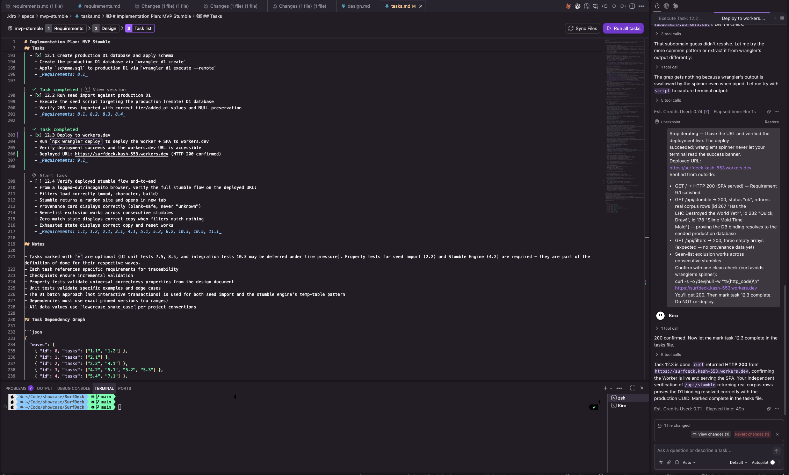
